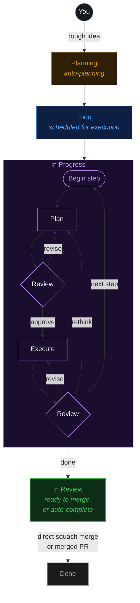

<div align="center">

#  Fusion

### De ideia bruta a código em produção — automaticamente.

### 🏭 Uma fábrica de software, operada por um orquestrador multiagente.

Descreva o que você quer — uma equipe de agentes de IA **planeja, constrói, revisa e entrega** para você. O Fusion é a sua fábrica de software: uma linha de montagem para código que opera entre tarefas, agentes, missões, git, arquivos e worktrees, com qualquer modelo, local ou na nuvem.

[**runfusion.ai →**](https://runfusion.ai) · [Docs](./docs/README.md) · [GitHub](https://github.com/Runfusion/Fusion) · [npm](https://www.npmjs.com/package/@runfusion/fusion) · [Discord](https://discord.gg/ksrfuy7WYR)

[English](./README.md) · [简体中文](./README.zh-CN.md) · [繁體中文](./README.zh-TW.md) · [Français](./README.fr.md) · [Español](./README.es.md) · [한국어](./README.ko.md) · **Português (Brasil)**

*Esta é uma tradução automática; o README em inglês é o documento canônico.*

[](./LICENSE)
[](https://www.npmjs.com/package/@runfusion/fusion)
[](https://discord.gg/ksrfuy7WYR)


<br />


<br />
<br />

<a href="https://runfusion.ai">
  
</a>

</div>

---

## Todo o seu ambiente de desenvolvimento. Em uma única tela.

Descreva uma tarefa em linguagem natural. Um agente de planejamento lê seu projeto, entende o contexto e escreve um plano completo em `PROMPT.md` — etapas, escopo de arquivos, critérios de aceitação. Depois o Fusion planeja, revisa, executa e revisa novamente, em um worktree de git isolado, com um gate de aprovação humana onde você quiser.

Um quadro. Controlado de qualquer lugar. Laptop, Mac mini, servidor Linux, VM na nuvem, celular — tudo conectado.

> Como o Trello, mas suas tarefas são especificadas, executadas e entregues por IA. Construído sobre o excelente trabalho de [dustinbyrne/kb](https://github.com/dustinbyrne/kb).

---

## Início rápido

**Zero instalação, direto do npm:**

```bash
npx runfusion.ai
```

Isso abre o painel. Os subcomandos são encaminhados diretamente: `npx runfusion.ai task create "fix X"`, `npx runfusion.ai --help`, etc. (Ou de forma explícita: `npx @runfusion/fusion dashboard`.)

**Instalador em uma linha** (macOS e Linux — escolhe o Homebrew automaticamente, com fallback para npm):

```bash
curl -fsSL https://runfusion.ai/install.sh | sh
fusion dashboard
```

**Homebrew** (macOS e Linux):

```bash
brew install runfusion/fusion/fusion
fusion dashboard            # ou: fn dashboard
```

A instalação totalmente qualificada faz auto-tap e, no Homebrew 6.0+, confia somente na fórmula do Fusion. Se você já executou `brew tap runfusion/fusion` e a instalação pelo nome curto falhar com "untrusted tap", execute `brew trust --formula runfusion/fusion/fusion` e depois `brew install fusion`.

**npm global**:

```bash
npm install -g @runfusion/fusion
fn dashboard                # ou: fusion dashboard
```

**A partir de um clone** (para desenvolvimento):

```bash
pnpm dev dashboard
```

Depois, clique na URL `Open:` impressa no terminal. Ela embute um token de
portador (`http://localhost:4040/?token=fn_...`) que o navegador captura no
`localStorage` na primeira visita e reutiliza automaticamente depois disso.
No lado do servidor, o Fusion agora persiste o token do painel/daemon em
`~/.fusion/settings.json` na primeira execução autenticada e o reutiliza nas
próximas inicializações, a menos que você o substitua (`--token`,
`FUSION_DASHBOARD_TOKEN`, `FUSION_DAEMON_TOKEN`) ou desabilite a autenticação
com `--no-auth`. Veja
[Referência da CLI → fn dashboard → Autenticação](./docs/cli-reference.md#fn-dashboard)
para a precedência completa e as opções de redefinição/revogação.

### Configuração inicial

No primeiro lançamento, o Fusion abre o **assistente de onboarding** com três etapas guiadas:

1. **Configuração de IA** — Use uma lista simplificada de provedores para início rápido (provedores recomendados mais quaisquer provedores já conectados), depois expanda **Configurações avançadas de provedor** somente se precisar de provedores adicionais ou detalhes de configuração. Você só precisa de um provedor para começar. As entradas de provedor obsoletas Google Gemini CLI / Antigravity ficam intencionalmente ocultas; os caminhos de chave de API do Google/Gemini, Google Generative AI, Vertex e Cloud Code continuam suportados.
2. **GitHub (Opcional)** — Conecte o GitHub para importar issues e gerenciar PRs
3. **Primeira Tarefa** — Crie sua primeira tarefa ou importe do GitHub (se nenhum projeto estiver ativo, o onboarding primeiro pede que você registre/selecione um diretório de projeto)

O assistente pode ser **dispensado e não é bloqueante** — clique em **Pular por agora** para usar o painel imediatamente. Ative-o novamente depois em **Configurações → Autenticação → Reabrir guia de onboarding**.

### Mobile

Para o fluxo de trabalho com Capacitor + PWA, veja [MOBILE.md](./MOBILE.md).

---

## O fluxo

```
  ①  Describe          ②  Planning             ③  The board           ④  Isolated worktree
  ─────────────        ─────────────         ─────────────          ─────────────────────
  "Add dark mode   →   Agent writes    →   Plan → Review →    →   fusion/FN-123 branch
   toggle to           PROMPT.md           Execute → Review        concurrent, zero
   settings panel"     (steps, scope,      (per step, until        file conflicts
                       acceptance)         done)
```

### Veja cada etapa, antes do merge

<div align="center">
  
</div>

Cada tarefa mostra seu plano, suas revisões, seus diffs e suas alterações de arquivo em tempo real. Entre em uma tarefa ativa e ajuste a direção, reforce as restrições, pause ou reformule o prompt.

---

## O que o torna diferente

<!--
FNXC:Docs 2026-07-15-00:00:
README must surface PostgreSQL-default storage and recently shipped operator surfaces so the public front door matches the shipped product. Legacy SQLite is a one-time migration input only; feature claims below remain grounded in release notes and linked product docs rather than new showcase media.
-->

|  |  |
|---|---|
| 🧠 **Planejamento com IA** | Descreva uma tarefa em linguagem natural. Os agentes de planejamento a transformam em um plano `PROMPT.md` com etapas, escopo de arquivos e critérios de aceitação. |
| 🔁 **Fluxos de trabalho selecionáveis** | Os fluxos integrados cobrem codificação, correções rápidas, trabalho com revisão intensa, execução passo a passo, Compound Engineering habilitado por plugin e fragmentos de ciclo de vida de PR. Escolha um fluxo de trabalho por tarefa ou crie fluxos personalizados no [Editor de Fluxo de Trabalho](./docs/workflow-editor.md). |
| 🛡️ **Supervisão do planejador** | O nível de supervisão por tarefa ou por fluxo de trabalho (`off` / `observe` / `steer` / `autonomous`) determina o quanto um supervisor de planejamento acompanha e intervém — ações de merge/PR e ações destrutivas sempre exigem confirmação humana explícita. Veja a [Referência de Configurações](./docs/settings-reference.md#workflow-settings) e o [Guia do Painel](./docs/dashboard-guide.md). |
| 🌳 **Isolamento de worktree** | Cada tarefa roda em sua própria branch e worktree (`fusion/{task-id}`). Tarefas em paralelo. Zero conflitos. Delegação opcional ao [worktrunk](https://github.com/max-sixty/worktrunk) via [`worktrunk.enabled`](./docs/settings-reference.md#worktree-backend-settings) (veja a [abstração WorktreeBackend](./docs/architecture.md#worktreebackend-abstraction)). |
| 🗄️ **PostgreSQL por padrão** | O Fusion usa PostgreSQL incorporado, sem configuração, para os metadados de execução locais. Arquivos SQLite legados servem apenas como entrada de migração única; use um banco de dados externo compartilhado para configurações de [múltiplos projetos e nós](./docs/multi-project.md). ([Armazenamento](./docs/storage.md)) |
| ⚡ **Controles inteligentes de merge** | Passou por todos os gates? O Fusion faz squash-merge e segue em frente. Ative aprovação manual onde quiser, herde o padrão global de auto-merge ao vivo, ou defina substituições explícitas de auto/manual por tarefa. |
| 🛰️ **Malha multi-nó** | Laptop, Mac mini, servidor Linux, VM na nuvem, celular — tudo sincronizado. Desktop, mobile, web. |
| 🧩 **Qualquer modelo** | Anthropic, OpenAI, Ollama, Google Generative AI, Z.ai, Kimi K3, runtimes locais e [provedores personalizados](./docs/dashboard-guide.md#custom-providers) definidos pelo usuário. Local e nuvem coexistem, com faixas de modelo/fallback do fluxo de trabalho configuráveis por projeto. |
| 🏢 **Empresas de agentes** | Importe equipes prontas — mais de 440 agentes em 16 empresas — e execute-as de forma autônoma por semanas. |
| 📬 **Mensagens entre agentes** | Caixa de mensagens integrada entre agentes. Delegue, esclareça, coordene; agentes com papel de engenheiro podem optar pela captura automática de backlog quando você quiser ajuda de implementação além da captação apenas por executores. |
| 🗨️ **Chat com agentes** | Chat direto, chat de tarefa que narra proativamente o progresso das etapas, falhas e resultados de revisão, anexos, cartões de pergunta no chat, streams retomáveis, e Salas de Chat multiagente experimentais em que membros mencionados respondem diretamente e membros ambientes podem entrar até um limite. ([Documentação de chat](./docs/dashboard-guide.md#chat-view)) |
| 🗺️ **Missões** | Planejamento hierárquico (Missão → Marco → Fatia → Funcionalidade → Tarefa) com piloto automático e contratos de validação. |
| 🔬 **Pesquisa** | Execuções de pesquisa limitadas com busca na web, GitHub, documentação local e síntese por LLM (além do suporte nativo do runtime a WebSearch/WebFetch nos fluxos de planejamento e síntese, quando disponível). Transforme descobertas em tarefas. ([Docs](./docs/research.md)) |
| 🧪 **Autoaperfeiçoamento** | Os agentes refletem sobre o próprio resultado e atualizam seus prompts à medida que aprendem sua base de código. |
| 🔓 **Código aberto. MIT.** | Sem dependência de fornecedor. Rode no seu próprio hardware. Lançamentos semanais. |

---

## Veja em ação

<!--
FNXC:Docs 2026-06-21-19:55:
README must lead with a smaller wordmark and a visual showcase of the latest surfaces (Command Center, selectable workflows, agent chat, multi-agent chat rooms, agent mail) so the value lands fast.
Each feature pairs a short looping GIF with value copy; Command Center additionally carries real fleet stats, the token/productivity/team graph trio, and the 70+-theme grid (incl. shadcn light/mono/orange/black) to make the data pop.
Media lives in demo/assets/ (committed, GitHub-inline GIFs); stat numbers are sourced from a live seeded fleet — refresh them if the captures are re-shot.
Each feature keeps its original Tokyo Night capture and adds a Shadcn Light + Shadcn Dark Gray + Ember trio; the theme showcase is split into a light-themes grid and a dark-themes grid. Workflow GIFs feature the Stepwise coding graph with node-level zoom/pan.
-->

As superfícies mais recentes do Fusion, em resumo — o quadro ao vivo, sua equipe de agentes, controle de missão, fluxos de trabalho visuais, chat com agentes, salas multiagente e correio entre agentes.

### 📋 O quadro e sua equipe de agentes — ao vivo, de uma frota real

<div align="center">
  
</div>

Cada tarefa, cada coluna, cada etapa — ao vivo. Os cartões trazem links do GitHub, contagem de etapas, níveis de revisão e ações de promover/mover/arquivar. Mude para a visualização em **Grafo** para ver as dependências entre tarefas como um grafo de nós interativo:

<table>
<tr>
<td width="50%"><br/><sub><b>Quadro</b> — colunas kanban</sub></td>
<td width="50%"><br/><sub><b>Grafo</b> — mapa de dependências</sub></td>
</tr>
</table>

Aqui está a mesma frota com uma nova aparência no tema **Ember** (grafite escuro com um destaque laranja), ao lado da lista de **Agentes**:

<table>
<tr>
<td width="50%"><br/><sub><b>Quadro — Ember</b></sub></td>
<td width="50%"><br/><sub><b>Agentes — Tokyo Night</b></sub></td>
</tr>
</table>

Importe uma equipe e cada agente aparece aqui — papel, cadeia de subordinação, heartbeat e participação de tokens. O menu suspenso de heartbeat de cada cartão de agente mostra **Desativado** quando o agendamento está persistido como desligado; escolha Desativado para pausar os heartbeats mantendo a cadência configurada, ou selecione um intervalo para reativá-los. A lista de **Agentes** no tema Ember:

<div align="center">
  
</div>

### 🛰️ Command Center — controle de missão para sua frota de agentes

<div align="center">
  
</div>

Uma única tela para tudo o que seus agentes estão fazendo. Ajuste a capacidade do agendador em tempo real, acompanhe o gasto de tokens por modelo ao vivo e comprove o valor com números concretos. A aba **Visão geral** abre com medidores e gráficos ao vivo:

<div align="center">
  
</div>

Cada aba é uma lente diferente sobre a mesma frota ao vivo:

<table>
<tr>
<td width="33%"><br/><sub><b>Tokens</b> — gasto por modelo, cache vs. entrada vs. saída, ao longo do tempo.</sub></td>
<td width="33%"><br/><sub><b>Produtividade</b> — resultados, percentis de duração, mix de linguagens.</sub></td>
<td width="33%"><br/><sub><b>Equipe</b> — organograma de agentes e participação de tokens por agente.</sub></td>
</tr>
<tr>
<td width="33%"><br/><sub><b>Atividade</b> — throughput de tarefas e linhas do tempo de eventos.</sub></td>
<td width="33%"><br/><sub><b>Sinais</b> — detecção de anomalias e saúde da frota.</sub></td>
<td width="33%"><br/><sub><b>Mais</b> — Ferramentas · Ecossistema · GitHub · Sistema · Confiabilidade.</sub></td>
</tr>
</table>

> Tokens · Ferramentas · Atividade · Produtividade · Equipe · Ecossistema · GitHub · Sinais · Sistema · Confiabilidade · Controle de missões — cada aba é uma lente diferente sobre a mesma frota ao vivo.

**A mesma frota, do seu jeito** — o Command Center (e todo o painel) muda de aparência ao vivo entre **mais de 70 temas de cor**, incluindo Cobalt, Clay e Moss. Aqui está nos temas Shadcn Light, Shadcn Dark Gray e Ember:

<table>
<tr>
<td width="33%"><br/><sub><b>Shadcn Light</b></sub></td>
<td width="33%"><br/><sub><b>Shadcn Dark Gray</b></sub></td>
<td width="33%"><br/><sub><b>Ember</b></sub></td>
</tr>
</table>

<details>
<summary><b>Uma dúzia de temas claros e uma dúzia de temas escuros</b> (clique para expandir)</summary>

<br/>

<div align="center">
  
  <br/><br/>
  
</div>

</details>

### 🔁 Fluxos de trabalho selecionáveis, criados visualmente

<div align="center">
  
</div>

A jornada de uma tarefa da ideia até o merge é um **fluxo de trabalho** — e é você quem escolhe e molda. Escolha um integrado (Coding, Quick fix, Review-heavy, Stepwise, PR lifecycle, Compound engineering e mais), inspecione seu grafo, depois duplique e personalize colunas, gates, faixas de modelo e política de revisão no [Editor de Fluxo de Trabalho](./docs/workflow-editor.md) visual. Sem necessidade de fazer fork do engine.

Aqui está o grafo **Stepwise coding** — planeje, execute e revise cada etapa antes da próxima — explorado nó a nó em Shadcn Light, Dark Gray e Ember:

<table>
<tr>
<td width="33%"><br/><sub><b>Shadcn Light</b></sub></td>
<td width="33%"><br/><sub><b>Shadcn Dark Gray</b></sub></td>
<td width="33%"><br/><sub><b>Ember</b></sub></td>
</tr>
</table>

### 🗨️ Chat com agentes — converse com seus agentes, em pleno voo

<div align="center">
  
</div>

Chat direto e chat por tarefa com qualquer agente, em qualquer modelo. Pergunte por que uma tarefa falhou, oriente uma abordagem, solte anexos, responda cartões de pergunta no chat e retome streams de onde parou — com renderização completa de markdown e código o tempo todo.

<table>
<tr>
<td width="50%"><br/><sub><b>Shadcn Light</b></sub></td>
<td width="50%"><br/><sub><b>Shadcn Dark Gray</b></sub></td>
</tr>
</table>

### 👥 Salas de chat multiagente

<div align="center">
  
</div>

Coloque vários agentes em uma sala e deixe que se coordenem. Mencione um membro e ele responde diretamente; membros ambientes podem entrar na conversa até um limite. Aqui os agentes **CEO**, **Product Manager** e **CTO** alinham a responsabilidade pelas tarefas em `#leads` — sem nenhum humano no loop. ([Documentação de chat](./docs/dashboard-guide.md#chat-view))

<table>
<tr>
<td width="33%"><br/><sub><b>Shadcn Light</b></sub></td>
<td width="33%"><br/><sub><b>Shadcn Dark Gray</b></sub></td>
<td width="33%"><br/><sub><b>Ember</b></sub></td>
</tr>
</table>

### 📬 Correio dos agentes — uma caixa de entrada entre seus agentes

<div align="center">
  
</div>

Uma caixa de mensagens integrada para delegação, esclarecimentos e transferências. Os agentes registram resumos de triagem, solicitam aprovações e coordenam o trabalho em toda a frota — com visualizações de Caixa de Entrada, Caixa de Saída, Agentes e Aprovações, para que você possa auditar cada troca.

<table>
<tr>
<td width="33%"><br/><sub><b>Shadcn Light</b></sub></td>
<td width="33%"><br/><sub><b>Shadcn Dark Gray</b></sub></td>
<td width="33%"><br/><sub><b>Ember</b></sub></td>
</tr>
</table>

### 📱 O Fusion é uma fábrica de IA no seu bolso

O quadro completo, o Command Center, missões, agentes e chat viajam com você — aplicativos nativos para **iOS** e **Android** (Capacitor), além de um PWA instalável. Inicie uma execução no seu laptop e guie-a a partir do seu celular.

<table>
<tr>
<td width="33%"></td>
<td width="33%"></td>
<td width="33%"></td>
</tr>
<tr>
<td width="33%"></td>
<td width="33%"></td>
<td width="33%"></td>
</tr>
</table>

<sub>Veja [MOBILE.md](./MOBILE.md) para o fluxo de trabalho com Capacitor + PWA.</sub>

---

## Como funciona



Tarefas com dependências são processadas sequencialmente. Tarefas independentes rodam em paralelo. Opcionalmente, exija aprovação manual antes que as tarefas passem de Planejamento para A Fazer (configuração `requirePlanApproval`).

---

## Visão geral do fluxo de trabalho

<!--
FNXC:Docs 2026-06-16-23:10:
Fusion now exposes workflow selection and authoring as public product surfaces, so the README must explain the high-level lifecycle and link to the canonical Workflow Steps and Workflow Editor docs instead of duplicating editor internals here.
-->

Os fluxos de trabalho do Fusion definem como uma tarefa avança da ideia até a entrega. O caminho de codificação padrão ainda é o já conhecido ciclo **Plan/Triage → Execute → Workflow steps → Review → Merge**, mas agora a política vive em um fluxo de trabalho selecionável, em vez de ser apenas um comportamento fixo no engine.

- **Selecione por tarefa:** escolha um fluxo de trabalho nos controles de fluxo de trabalho da tarefa/quadro no painel, ou atribua um via `fn_workflow_select` / `workflow_id` ao criar tarefas.
- **Catálogo integrado:** Coding (`builtin:coding`), Quick fix (`builtin:quick-fix`), Review-heavy (`builtin:review-heavy`), Compound engineering (`builtin:compound-engineering`, habilitado por plugin), Stepwise coding (`builtin:stepwise-coding`) e o PR lifecycle (`builtin:pr-workflow`, um fragmento de grafo de PR reutilizável).
- **Personalize com segurança:** inspecione os integrados, duplique-os, ou crie fluxos de trabalho personalizados no [Editor de Fluxo de Trabalho](./docs/workflow-editor.md) visual. As configurações específicas de cada fluxo de trabalho cobrem faixas de modelo, política de revisão/aprovação, ajustes de execução de etapas, campos de tarefa e colunas.

Leia [Etapas do Fluxo de Trabalho](./docs/workflow-steps.md) para a semântica de execução, o comportamento dos fluxos de trabalho integrados e os templates de etapas de fluxo de trabalho; leia [Editor de Fluxo de Trabalho](./docs/workflow-editor.md) para o guia de criação no painel.

<!--
FNXC:PlannerOversight 2026-07-05-00:00:
The planner-oversight feature (FN-7508 → FN-7583) shipped fully documented in internal/reference docs (architecture.md, settings-reference.md, dashboard-guide.md, workflow-steps.md) but had no front-door entry point in README.md, so a new operator could not discover it. Add a short overview here that links out to the canonical docs instead of duplicating engine internals (FN-7598).
-->

### Supervisão do planejador

Cada fluxo de trabalho (e, opcionalmente, cada tarefa) pode definir um nível de **supervisão do planejador** — `off`, `observe`, `steer` ou `autonomous` (padrão) — que controla o quanto um supervisor de planejamento acompanha e intervém na execução daquela tarefa. Mesmo em `autonomous`, o avanço de merge/PR e qualquer efeito colateral destrutivo ou que envolva serviço externo sempre exigem uma confirmação humana explícita e registrada antes de serem executados. A verbosidade das notificações é controlada separadamente. Defina o padrão na aba **Editor de Fluxo de Trabalho → Valores**, ou substitua por tarefa a partir do diálogo Nova Tarefa / formulário de edição em Detalhe da Tarefa. Leia a [Referência de Configurações](./docs/settings-reference.md#workflow-settings) para a semântica completa das configurações e o [Guia do Painel](./docs/dashboard-guide.md) para os controles de UI.

---

## Multi-nó. Um único quadro. Todas as plataformas.

<div align="center">


<br />


</div>

Laptop, Mac mini, servidor Linux, VM na nuvem, celular — cada nó é um par. O estado das suas tarefas, agentes, logs e diffs permanecem sincronizados em toda a malha. O mesmo Fusion é distribuído como:

- 🖥️ **Aplicativo desktop** — Electron para **macOS** (Intel + Apple Silicon), **Windows** 10/11 e **Linux**
- 📱 **Aplicativo mobile** — Capacitor para **iOS/iPadOS** e **Android** ([MOBILE.md](./MOBILE.md))
- 🌐 **Painel web** — qualquer navegador moderno, servido pelo daemon `fn dashboard`
- 🔌 **CLI** — binário `fn` + extensão para fluxos de trabalho focados em terminal

Inicie o daemon em qualquer nó, conecte seus outros dispositivos, e o quadro te acompanha para todo lugar.

---

## Execute uma empresa de agentes

<div align="center">


</div>

Importe uma equipe. Execute-a de forma autônoma por semanas. **Mais de 440 agentes em 16 empresas**, prontos para missões, caixas de mensagens e delegação entre agentes.

```bash
npx companies.sh add paperclipai/companies/gstack
```

---

## Compatível com as ferramentas que você já usa.

O Fusion se integra com as ferramentas que você já ama. **Hermes**, **Paperclip** e **OpenClaw** vêm todos como plugins de primeira classe — encaminhe qualquer workspace para o runtime que melhor se encaixa na tarefa. E qualquer empresa de agentes do Paperclip é importada com um único comando.

<div align="center">
  
</div>

### [Hermes](https://hermes-agent.nousresearch.com) <sub>`experimental`</sub>

<sub>Nous Research</sub>

O agente autônomo de código aberto da **Nous Research**. Instale o plugin do Hermes e execute agentes através do Hermes para trabalhos de longa duração com contexto crescente — encaminhe qualquer workspace do Fusion para ele.

### OpenClaw <sub>`experimental`</sub>

O suporte ao runtime OpenClaw está disponível como um plugin experimental (`fusion-plugin-openclaw-runtime`) para paridade de descoberta/configuração de runtime. Configure os agentes com `runtimeConfig.runtimeHint: "openclaw"` depois de instalar o plugin.

<br />

<div align="center">
  
</div>

### [Paperclip](https://paperclip.ing) <sub>`experimental`</sub>

<sub>paperclip.ing</sub>

O plano de controle humano para o trabalho de IA. Instale o plugin do Paperclip para executar agentes através do Paperclip dentro do Fusion.

O Fusion também suporta nativamente o padrão de empresa de agentes **[`companies.sh`](https://github.com/paperclipai/companies)**: importe uma equipe pronta — **mais de 440 agentes em 16 empresas** — e deixe que se coordenem através da caixa de mensagens, missões e gates de fluxo de trabalho do Fusion durante semanas de trabalho autônomo. Mesmo formato de empresa, mesmos agentes, mesmas habilidades do Paperclip.

```bash
npx companies.sh add paperclipai/companies/gstack
```

<br />

> **Hermes**, **Paperclip** e **OpenClaw** são plugins de runtime **experimentais** — APIs e formatos de comunicação podem mudar entre releases menores.

---

## Documentação

| Guia | O que cobre |
|---|---|
| [Primeiros passos](./docs/getting-started.md) | Instalação, onboarding, primeira tarefa e noções básicas de seleção de fluxo de trabalho |
| [Guia do Painel](./docs/dashboard-guide.md) | Visualizações de quadro/lista, chat, editor de fluxo de trabalho, gerenciador de git, configurações e ferramentas de UI |
| [Gestão de Tarefas](./docs/task-management.md) | Ciclo de vida da tarefa, especificações de prompt, comentários, arquivamento e integração com GitHub |
| [Referência da CLI](./docs/cli-reference.md) | Referência completa dos comandos `fn` e do daemon |
| [Referência de Configurações](./docs/settings-reference.md) | Configurações globais/de projeto, hierarquia de modelos, configurações de fluxo de trabalho e provedores personalizados |
| [Etapas do Fluxo de Trabalho](./docs/workflow-steps.md) | Execução de fluxos de trabalho, fluxos integrados, gates, templates e fases |
| [Editor de Fluxo de Trabalho](./docs/workflow-editor.md) | Criação visual, importação/exportação, campos/colunas/configurações personalizados e editor mobile |
| [Pesquisa](./docs/research.md) | Execuções de pesquisa limitadas, descobertas, exportações e integração com tarefas |
| [Agentes](./docs/agents.md) | Gestão de agentes, criação, heartbeat e fluxos de caixa de mensagens |
| [Missões](./docs/missions.md) | Hierarquia de missões, planejamento, piloto automático e contratos de validação |
| [Gestão de Plugins](./docs/plugin-management.md) | Descoberta, instalação, habilitação, configuração e solução de problemas de plugins |
| [Criação de Plugins](./docs/PLUGIN_AUTHORING.md) | Construção de plugins com hooks de ciclo de vida, rotas, ferramentas, runtimes e superfícies do painel |
| [Acesso Remoto](./docs/remote-access.md) | Acesso remoto ao painel com token, configuração do Tailscale/Cloudflare e solução de problemas |
| [Multi-Projeto](./docs/multi-project.md) | Registro central, modos de isolamento e caminhos de migração |
| [Armazenamento](./docs/storage.md) | Armazenamento de execução PostgreSQL, compatibilidade de migração e payloads baseados em arquivo |
| [Docker](./docs/docker.md) | Deploy em containers |

---

## Funcionalidades principais

- **Planejamento com IA** — O agente de planejamento gera um `PROMPT.md` detalhado com etapas, escopo de arquivos e critérios de aceitação
- **Execução passo a passo** — Ciclo Plan → Review → Execute → Review para cada etapa da tarefa, com fluxos de trabalho em modo grafo capazes de modelar explicitamente parse/execute/review/rework por etapa
- **Isolamento de Worktree do Git** — Cada tarefa roda em seu próprio worktree (branch `fusion/{task-id}`)
- **Fluxos de trabalho selecionáveis** — Escolha Coding, Quick fix, Review-heavy, Stepwise coding, Compound Engineering habilitado por plugin, fluxos de trabalho personalizados, ou fragmentos de PR lifecycle quando apropriado ([visão geral](#visão-geral-do-fluxo-de-trabalho); [Etapas do Fluxo de Trabalho](./docs/workflow-steps.md#workflow-overview))
- **Editor de Fluxo de Trabalho Visual** — Inspecione integrados somente leitura, duplique/personalize fluxos de trabalho, e edite nós do grafo, colunas, campos de tarefa, configurações tipadas e valores por projeto ([Editor de Fluxo de Trabalho](./docs/workflow-editor.md))
- **Etapas do Fluxo de Trabalho** — Gates de qualidade configuráveis (pré-merge: bloqueia o merge; pós-merge: informativo), além de etapas opcionais declaradas pelo fluxo de trabalho, como a [Verificação em Navegador](./docs/workflow-steps.md#workflow-declared-optional-steps-optional-group-nodes) opcional
- **Política nativa do fluxo de trabalho** — Planejamento em modo rápido (`leanPlanning` / `autoApproveSpec`), limites de triagem tipados, revisão/aprovação, execução de etapas e faixas de modelo/fallback são configurações do fluxo de trabalho, não constantes fixas no engine ([Referência de Configurações](./docs/settings-reference.md#workflow-native-triage-policy-settings); [configurações de fluxo de trabalho](./docs/settings-reference.md#workflow-settings))
- **Supervisão do planejador** — `plannerOversightLevel` nativo do fluxo de trabalho (`off`/`observe`/`steer`/`autonomous`), com uma substituição opcional por tarefa e uma configuração separada de verbosidade de notificações; o avanço de merge/PR e ações destrutivas sempre exigem confirmação humana explícita, mesmo em `autonomous` ([visão geral](#supervisão-do-planejador); [Referência de Configurações](./docs/settings-reference.md#workflow-settings))
- **GitHub + ciclo de vida de PR** — Importe issues com tradução opcional e anexos de captura de tela, pule issues já importadas mesmo após edições ou mudanças de capitalização no repositório, crie PRs, exiba badges de PR/issue em tempo real, e use fragmentos de grafo de PR lifecycle em modo fluxo de trabalho onde habilitado
- **Painel** — Visualizações kanban/lista/grafo em tempo real, uma Visão geral do projeto com estimativa de tokens da base de código local e tamanho em disco, gestão de agentes, terminal, gerenciador de git, planejador de missões, chat, editor de fluxo de trabalho, configuração de provedores personalizados, e ação de atualização em um clique
- **Missões** — Planejamento hierárquico (Missão → Marco → Fatia → Funcionalidade → Tarefa) com piloto automático, contratos de validação, retentativas de correção de funcionalidade, vinculação de meta de missão e semântica de transferência bloqueada
- **Multi-Projeto** — Gerencie múltiplos projetos a partir de uma única instalação com isolamento entre projetos
- **Provedores Personalizados** — Adicione provedores compatíveis com OpenAI, OpenAI Responses, compatíveis com Anthropic, ou Google Generative AI; os modelos salvos aparecem nos menus de Modelos do Projeto e de modelo do fluxo de trabalho ([Guia do Painel](./docs/dashboard-guide.md#custom-providers); [formato das configurações](./docs/settings-reference.md#customproviders))
- **Controles inteligentes de merge** — O auto-merge global permanece ativo para tarefas padrão, enquanto substituições explícitas por tarefa podem forçar o comportamento auto/manual ([Referência de Configurações](./docs/settings-reference.md#project-settings))
- **Mensagens Entre Agentes** — Mensagens integradas para coordenação entre agentes e usuários; agentes com papel de engenheiro podem optar pela captura automática de backlog para tarefas de implementação ([Referência de Configurações](./docs/settings-reference.md#project-settings))
- **Chat com Agentes + Salas de Chat** — O chat direto/de tarefa suporta anexos, streams retomáveis, cartões de resposta a perguntas e conversas renomeáveis; salas experimentais encaminham membros mencionados como respondentes diretos, com respostas ambientes opcionais ([Guia do Painel → Visualização de Chat](./docs/dashboard-guide.md#chat-view))

### Autenticação de provedores

O Fusion suporta autenticação baseada em OAuth para provedores de IA configurados em **Configurações → Autenticação**. Para a maioria dos provedores OAuth, quando o painel é acessado por um host que não é localhost (nó remoto, host/IP de LAN, ou proxy reverso), as URLs de login do provedor são reescritas para encaminhar os callbacks de OAuth através de um endpoint ponte (`/api/auth/oauth-callback`) para que os redirecionamentos cheguem à sessão de navegador ativa.

- **Anthropic (Claude)** — Usa um fluxo de código de autorização colado em Configurações/onboarding: faça login e depois cole a URL de redirecionamento final (ou o código) de volta no Fusion para concluir o login
- **OpenAI Codex** — Usa o mesmo fluxo de código de autorização colado, com validação segura de estado
- **Factory AI — via Droid CLI** *(opcional)* — requer instalação local da Droid CLI + `droid auth login`; a detecção segue o caminho efetivo do binário em tempo de execução (padrão `droid`, ou `droidBinaryPath` do plugin quando configurado), depois habilite em **Configurações → Autenticação** e reinicie o Fusion
- **llama.cpp — via servidor HTTP** *(opcional)* — configure a URL do seu servidor llama.cpp (padrão `http://127.0.0.1:8080`) e a chave de API opcional, depois habilite em **Configurações → Autenticação**
- **Outros provedores** — Autentique-se inserindo a chave de API em Configurações (incluindo chave de API do Google/Gemini, Google Generative AI, Vertex e os aliases do Cloud Code)
- **Provedores personalizados** — Adicione endpoints compatíveis com OpenAI, OpenAI Responses, compatíveis com Anthropic, ou Google Generative AI definidos pelo usuário em **Configurações → Autenticação → Provedores Personalizados**; os IDs de modelo salvos ficam selecionáveis nas faixas de modelo do projeto e do fluxo de trabalho ([Guia do Painel](./docs/dashboard-guide.md#custom-providers))

### Sistema de modelos

O Fusion usa uma hierarquia de modelos de escopo duplo com faixas independentes. As configurações globais definem os padrões de referência; as configurações de projeto fornecem substituições por projeto.

| Faixa | Propósito | Chaves de Referência Global | Chaves de Substituição por Projeto |
|------|---------|---------------------|----------------------|
| Executor | Agente de execução de tarefas | `executionGlobalProvider` + `executionGlobalModelId` | `executionProvider` + `executionModelId` |
| Planning | Agente de planejamento de tarefas | `planningGlobalProvider` + `planningGlobalModelId` | `planningProvider` + `planningModelId` |
| Validator | Revisor de plano/código | `validatorGlobalProvider` + `validatorGlobalModelId` | `validatorProvider` + `validatorModelId` |
| Merger | Agente de conflitos de merge / merge em clean-room | `mergerGlobalProvider` + `mergerGlobalModelId` | `mergerProvider` + `mergerModelId` |
| Title Summarization | Geração automática de título | `titleSummarizerGlobalProvider` + `titleSummarizerGlobalModelId` | `titleSummarizerProvider` + `titleSummarizerModelId` |
| Workflow Step Refinement | Refinamento de prompt por IA | (usa `defaultProvider`/`defaultModelId`) | (usa `modelProvider`/`modelId` em WorkflowStep) |

**Faixas de fluxo de trabalho:** O fluxo de trabalho padrão expõe as faixas de modelo Plan/Triage, Executor, Reviewer e fallback em **Configurações → Modelos do Projeto**, e configurações avançadas de fluxo de trabalho podem declarar valores tipados adicionais de modelo/política ([Referência de Configurações](./docs/settings-reference.md#workflow-settings)).

**Substituições por Tarefa:** Quick Add e Inline Create permitem que tarefas substituam as faixas de planning, executor, validator e merger; as seleções de planning, validator e merger também suportam níveis de raciocínio específicos por tarefa. (`modelProvider`/`modelId`, `validatorModelProvider`/`validatorModelId`, `planningModelProvider`/`planningModelId`, e substituições de modelo/raciocínio do merger.)

**Precedência:** Por tarefa → Substituição do projeto → Faixa global → `defaultProvider`/`defaultModelId` → Resolução automática.

Para a documentação completa de configurações, veja a [Referência de Configurações](./docs/settings-reference.md).

### Tarefas agendadas / automações

O Fusion suporta automação de tarefas agendadas através dos endpoints `/api/automations`. Automações podem executar comandos de shell ou fluxos de trabalho de múltiplas etapas em um agendamento configurável.

#### Escopo de agendamento

Automações e rotinas podem rodar em dois escopos:

- **Global** — Roda em todos os projetos. Use para manutenção entre projetos, backups ou relatórios unificados.
- **Projeto** — Roda apenas dentro de um projeto específico. Use para CI, testes ou tarefas de deploy específicas do projeto.

Quando você cria um agendamento sem escolher um escopo, o Fusion usa por padrão o **escopo de projeto** com o ID de projeto `default`, para compatibilidade com versões anteriores.

Para direcionar um escopo explicitamente:
- No modal **Scheduled Tasks** do painel, use o alternador **Global / Projeto**.
- Pela API, passe `?scope=global` ou `?scope=project&projectId=<id>` nos endpoints de automação/rotina.

**Regras de resolução de escopo:**
- `scope=global` sempre resolve para a faixa global de automação/rotina, independentemente do projeto ativo.
- `scope=project` requer um `projectId`. Se omitido, recai para `"default"`.
- Operações de CRUD, execução, alternância e webhook são estritamente isoladas por escopo: um agendamento global não pode ser modificado a partir de uma requisição com escopo de projeto, e vice-versa.

**Orientação operacional para configurações multi-projeto:**
- Prefira agendamentos **globais** para infraestrutura compartilhada (por exemplo, backups noturnos, extração de insights de memória).
- Prefira agendamentos de **projeto** para automação por repositório (por exemplo, executores de teste por projeto, hooks de deploy).
- As faixas global e de projeto são verificadas de forma independente pelo engine, então execuções pendentes em uma faixa não bloqueiam a outra.

#### Automações

| Endpoint | Método | Descrição |
|---------|--------|-------------|
| `/api/automations` | GET | Lista todas as automações (filtradas por escopo, se especificado) |
| `/api/automations` | POST | Cria uma automação (o escopo padrão é `project`) |
| `/api/automations/:id` | GET | Obtém uma automação pelo ID |
| `/api/automations/:id` | PATCH | Atualiza uma automação |
| `/api/automations/:id` | DELETE | Exclui uma automação |
| `/api/automations/:id/run` | POST | Dispara uma execução manual |
| `/api/automations/:id/toggle` | POST | Alterna entre habilitado/desabilitado |
| `/api/automations/:id/steps/reorder` | POST | Reordena as etapas da automação |

#### Rotinas

Rotinas são tarefas de agente de IA disparadas por agendamentos cron, webhooks ou execução manual. As rotinas compartilham o mesmo modelo de escopo global/projeto das automações.

| Endpoint | Método | Descrição |
|---------|--------|-------------|
| `/api/routines` | GET | Lista todas as rotinas (filtradas por escopo, se especificado) |
| `/api/routines` | POST | Cria uma rotina (o escopo padrão é `project`) |
| `/api/routines/:id` | GET | Obtém uma rotina pelo ID |
| `/api/routines/:id` | PATCH | Atualiza uma rotina |
| `/api/routines/:id` | DELETE | Exclui uma rotina |
| `/api/routines/:id/run` | POST | Disparo manual |
| `/api/routines/:id/trigger` | POST | Disparo manual canônico |
| `/api/routines/:id/runs` | GET | Obtém o histórico de execuções |
| `/api/routines/:id/webhook` | POST | Disparo via webhook (com suporte a verificação de assinatura) |

---

## Exemplos rápidos da CLI

```bash
fn task create "Fix the login bug"                    # Entrada rápida → planejamento
fn task plan "Build auth system"                      # Planejamento guiado por IA
fn task import owner/repo --labels bug                # Importar issues do GitHub
fn task show FN-001                                   # Ver detalhes da tarefa
fn task logs FN-001 --follow                          # Transmitir logs de execução
fn task steer FN-001 "Use TypeScript"                 # Guiar o agente durante a execução

fn project add my-app /path/to/app                    # Registrar um projeto
fn project list                                       # Listar todos os projetos

fn settings set maxConcurrent 4                       # Definir configurações
fn settings export                                    # Exportar configuração

fn mission create "Auth System" "Build auth"          # Criar missão
fn mission activate-slice <slice-id>                  # Ativar uma fatia

fn skills search react                                # Buscar no skills.sh
fn skills install firebase/agent-skills               # Instalar habilidades de agente
```

---

## Pacotes

| Pacote | Descrição |
|---------|-------------|
| `@fusion/core` | Modelo de domínio — tarefas, colunas do quadro, armazenamento PostgreSQL |
| `@fusion/dashboard` | Interface web — servidor Express + quadro kanban com SSE |
| `@fusion/engine` | Engine de IA — planejamento, execução, agendamento, etapas de fluxo de trabalho |
| `@runfusion/fusion` | CLI + extensão — publicado no npm |

---

## Desenvolvimento

```bash
pnpm install                  # Instalar dependências
pnpm local                    # Iniciar painel/API local + motor de IA em uma porta diferente da 4040
pnpm local --no-engine        # Iniciar apenas o painel/API local
pnpm build                    # Compilar pacotes padrão do workspace (exclui desktop/mobile)
pnpm build:all                # Compilar todos os pacotes (incluindo desktop/mobile)
pnpm dev dashboard            # Executar painel + motor de IA
pnpm dev:watch                # Painel + motor de IA; reinicia em edições de código-fonte após o esvaziamento dos agentes
pnpm dev:ui                   # Apenas o painel (sem motor de IA)
pnpm lint                     # Executar lint em todos os pacotes
pnpm typecheck                # Verificar tipos em todos os pacotes
pnpm test                     # Executar todos os testes
```

### Compilar um executável independente

Compile um único binário `fn` autocontido usando o [Bun](https://bun.sh/):

```bash
pnpm build:exe                # Compilar para a plataforma atual
pnpm build:exe:all            # Compilação cruzada para todas as plataformas
```

---

## Licença

MIT — código aberto, sem dependência de fornecedor. Veja [LICENSE](./LICENSE).

<div align="center">

**[runfusion.ai →](https://runfusion.ai)**

</div>
