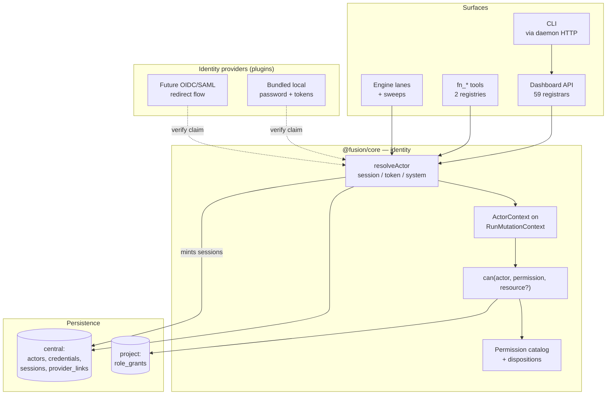
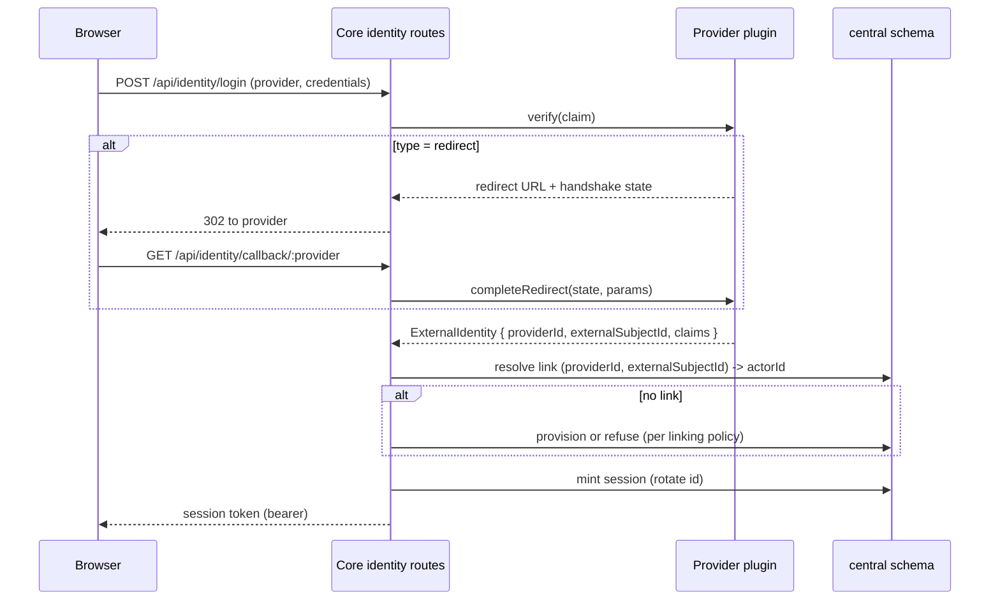
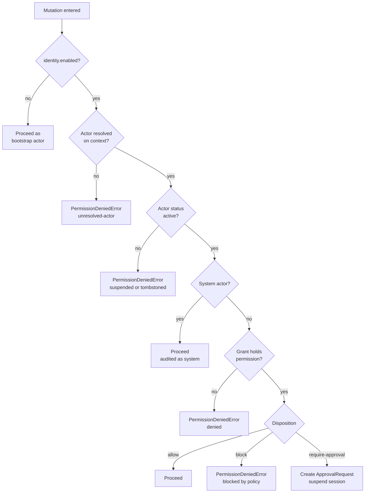
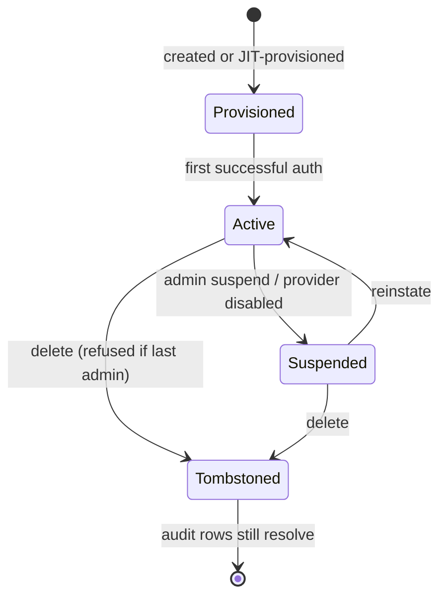

# Pluggable User Identity and Unified Authorization - Plan

## Goal Capsule

- **Objective:** Give Fusion one authenticated actor model covering humans and agents, a pluggable identity-provider extension point with a bundled local provider, and a single authorization model enforced in `@fusion/core` so every surface — dashboard API, CLI, headless daemon, agent tools, engine lanes — inherits the same checks.
- **Authority hierarchy:** Requirements (R-IDs) win on product behavior. Key Technical Decisions (KTD-IDs) win on implementation mechanism within their cited R constraints. Units override neither.
- **Execution profile:** Multi-phase program, not a single PR. Phases 0–5 below are sequenced; each phase is independently landable and leaves the tree green — which is not the same as leaving it enforcing, so retargeting and retiring the replaced gate is held to the last phase. Phase 0 ships three independent security fixes that do not depend on the actor model and should land even if the rest is deferred. Enforcement flips in two scopes: agent authorization once Phase 4's hardening lands, the human login boundary with U15/U16 (KTD22).
- **Stop conditions:** Stop and surface if (a) the `require-approval` disposition or its approval-redemption protocol cannot be expressed in the unified model — checked against classified invocations, not tool names (U4), (b) the CLI-to-daemon refactor in U11 uncovers a command that cannot function over HTTP, or (c) the plugin runtime's forced-RLS role can write `project.actor_role_grants` and cannot be revoked, which would move grants to `central` and reopen KTD7.
- **Tail ownership:** Standalone `ce-work` owns commit/PR/CI. Changeset required (`@runfusion/fusion`, `minor`).

---

## Product Contract

### Summary

Add a first-class actor model to Fusion covering both human users and agents, with pluggable identity providers and a single core-enforced permission system. Humans log in; agents hold their own authority rather than borrowing a user's; every mutation resolves an authenticated actor before it runs.

### Problem Frame

Fusion has no user concept. `packages/dashboard/src/auth-middleware.ts` gates `/api/*` behind one shared daemon bearer token that returns a boolean — there is no `req.principal`, no actor, no identity. Possession of that one secret grants every route, including `/api/system/restart` and `/api/secrets/*`.

The authorization situation is worse than "absent". Six overlapping actor vocabularies already exist, and four partial authorization mechanisms disagree about what an actor is:

- `AGENT_PERMISSIONS` (`packages/core/src/agents/agent-permissions.ts`) is an 18-entry `domain:verb` catalog with per-role defaults. It is decorative — its only consumers are `AgentStore.getAccessState()`, one read route, and UI checkboxes. No mutation path consults it.
- `AgentPermissionPolicy` (`packages/core/src/agents/agent-permission-policy.ts`) is the mechanism that actually runs, evaluated by `evaluateAgentActionGate` at pi tool-call time with `allow`/`block`/`require-approval` dispositions.
- `AgentAssignmentPolicy` and `resolveAgentProvisioningPolicy` gate routing and agent creation, the latter only from `fn_agent_create`/`fn_agent_delete` — dashboard REST bypasses it.
- `FusionSessionPrincipal` (`packages/core/src/session-identity-registry.ts`) resolves a caller by cwd and is process-local and non-persisted. Ambiguity fails closed and the async-context path takes precedence, but the **unregistered-cwd branch defaults to `{kind:"operator"}`**, so an agent in an unregistered cwd is classified as a human operator today.

None of this reaches the CLI at all. `packages/cli/src/commands/task.ts` has no principal resolution, so an agent shell running `fn task delete` already bypasses the withhold list that guards the equivalent tool call.

Attribution is equally fragmented and, in one place, actively wrong. `ConfigChangedBy` exists so internal writes can be marked as the system actor, but all five implementations default to `{kind:"human", id:"local-user"}` and exactly one production call site passes the field at all. Daemon token rotation (`packages/core/src/cli/daemon-token.ts:53,133`), auto-unpause, and scheduler ticks are all recorded in configuration-revision history as a local human.

A prior attempt at this already exists as dead schema: `project.project_auth_users`, `_memberships`, `_providers`, `_sessions` were created in migration `0004` and have zero TypeScript readers.

**The case for the mass of this work is the fragmentation above, not the strategy track.** STRATEGY.md's "Pluggable multi-user" track — "unlocking multi-user collaboration through open, pluggable extension points rather than a hardcoded model" — is satisfied by the provider extension point, which is one unit. What justifies the other twenty-three is that a product running autonomous agents that write code and merge branches currently has four disagreeing authorization mechanisms, one of which is decorative, one of which classifies an agent as a human operator, and none of which reaches the CLI. When a phase has to be cut, that is the criterion for which half is load-bearing.

### Requirements

**Actor model**

- R1. One actor model represents both humans and agents, with a `kind` discriminator, and replaces the six existing actor vocabularies.
- R2. An agent's authority is its own, resolved from its own role grants. Delegation ("acting for" a queuing human) is a distinct, separately-modeled relationship, never a collapse into an effective user.
- R3. Actors are global and live in the `central` schema; role grants are per-project and live in the `project` schema.
- R4. Actors are tombstoned on delete, never hard-deleted, so audit rows referencing them still resolve.
- R5. Authorization decisions use the outermost actor, and permissions are never unioned up a delegation chain. When `actingFor` is present, the decision additionally requires the permission to be held by the delegating actor, so a delegated action never exceeds what the delegator could do alone.
- R28. `actingFor` is set only on genuinely delegated requests — work a human queued and an agent carries out on their behalf. Autonomous agent work leaves it unset and runs on the agent's own authority (R2).

**Authentication**

- R6. Identity providers are a pluggable extension point in the existing plugin system, discoverable via manifest metadata and instantiated via a factory.
- R7. A bundled local identity provider ships by default and supports username/password login plus long-lived machine tokens.
- R8. The provider interface carries a type discriminator supporting both direct-verify and redirect-based flows from the first version, so an OIDC/SAML provider can be added without changing the interface.
- R9. Core owns session issuance, account linking, provisioning, and role mapping. A provider verifies an identity claim and returns a normalized external identity; it never mints a session or decides a role.
- R10. External identities are linked to actors through a `(providerId, externalSubjectId)` link table, present from the first version even though the local provider trivially populates it.
- R11. Sessions are opaque, server-side, durable across daemon restart, and carried on the existing bearer transport.
- R12. Session identifiers rotate on login and on privilege change. Human sessions expire on both an idle and an absolute timeout; the idle default is long enough to survive the laptop-to-phone check-in pattern rather than taxing it.
- R29. Agent sessions carry a separate lifetime policy: no idle timeout (an agent is idle by design between heartbeats), an absolute lifetime bounded by run duration with in-run renewal, and revocation checked at each tool call rather than enforced by expiry. Applying the human policy would kill a multi-hour run mid-tool-call; exempting agents from expiry entirely would create a non-expiring credential.

**Authorization**

- R13. A single permission model replaces both `AGENT_PERMISSIONS` and `AgentPermissionPolicy`, preserving the `allow` / `block` / `require-approval` dispositions that live approval flows depend on.
- R14. Authorization is deny-by-default and fails closed, including on error paths and for unresolved actors.
- R15. Permission checks are enforced in `@fusion/core` at the mutation seam, so every write surface inherits them without re-implementation.
- R16. A permission denial raises a typed core error whose message survives to whatever terminal state the caller reaches.
- R17. An actor can never grant itself or another actor a permission it does not itself hold.

**Security boundary**

- R18. The CLI performs state mutations through the authenticated daemon rather than opening the task store in-process.
- R19. The bootstrap daemon token can be sealed once a real administrator exists, and a CLI-based administrator recovery path exists.
- R20. `--no-auth` disables human transport authentication and logs that it has done so on every boot. It does not disable agent authorization: agents still resolve to their own actor and their grant dispositions stay enforced, because the gate it replaces is evaluated at tool-call time today and is independent of whether a transport token is configured.
- R30. The pre-auth identity routes are rate-limited and lockout-protected per source and per actor, with a bounded concurrent-hash limit so password hashing cannot be used to exhaust memory.
- R31. The last administrator cannot be deleted or demoted without an explicit force flag.
- R32. Identity and authorization audit records are retained independently of the operational-log retention setting, so an actor cannot erase evidence of its own actions by editing retention.

**Attribution**

- R21. The authenticated actor is a distinct persisted field from the existing self-reported `x-fusion-client` attribution, which remains non-authoritative.
- R22. Unattended paths — schedulers, sweeps, automations, webhooks, plugin writes, merge commits — carry an explicit system actor rather than defaulting to a human.
- R23. New records (tasks, chats, agent runs, merges, configuration revisions) record the acting actor. Existing rows are not backfilled.

**Surfaces**

- R24. A human reaches a login boundary before the dashboard renders any authenticated view.
- R25. The UI hides affordances the current actor lacks permission for, as a non-authoritative second pass over server-side enforcement.
- R26. Agent-to-human messages and questions route to a specific actor rather than the single shared `DASHBOARD_USER_ID` mailbox.
- R27. Existing single-user installations continue to work across upgrade and are never locked out.

### Scope Boundaries

**In scope**

Actor model, sessions, provider extension point, bundled local provider, unified permission model, core enforcement, CLI-to-daemon refactor, attribution across unattended paths, login UI and role administration, bootstrap and upgrade path.

**What ships, stated plainly.** The shipped posture is **one human operator plus governed agents**, not collaborative multi-user. A second human actor is representable and can hold different roles per project, but shares every task, chat, and board with the first — authorization governs mutations and administrative reads, not visibility. The STRATEGY track this work sits on is served by the extension point (U7) and the actor model; collaborative multi-user arrives only with the deferred per-actor isolation work below. The load-bearing near-term value is governing what the agent fleet may do, which is why agent enforcement activates ahead of the human login boundary (KTD22).

#### Deferred to Follow-Up Work

- Shipping a concrete external provider (OIDC, SAML, GitHub SSO). U7 proves the extension point can host a redirect flow; no such provider ships here.
- Per-actor data isolation and row-level filtering of tasks, chats, or boards. All actors in a project see the same data; authorization governs mutations and administrative reads only.
- Organization and team hierarchies above the project level.
- Postgres-level role separation. See the residual under System-Wide Impact — the hard boundary this plan builds stops at the daemon, not at the database.
- Backfilling or correcting configuration-revision rows already attributed to `local-user`. U14 stops the falsification going forward; see Open Questions Q1 for the disposition of existing rows.

#### Outside this product's identity

- Fusion does not become an identity provider for other systems. It consumes identity; it does not issue federated tokens outward.
- No per-user billing, quota, or usage metering.

### Acceptance Examples

- AE1. **Fresh install, identity off.** Given a new install with no actors, when the operator runs `fn serve` and opens the dashboard, then the bootstrap token works, first-administrator creation is offered, and identity stays off until explicitly enabled. Covers R27.
- AE2. **Agent cannot self-approve.** Given administrator `alice` and agent `exec-1`, when `exec-1` calls the approval-decision route using its own session, then the request is denied and the audit row records `exec-1` as the attempted decider rather than a hardcoded default actor. Covers R2, R14.
- AE3. **Denial is distinguishable from expiry.** Given `bob` holds a viewer role, when `bob` issues a task delete over HTTP, then the response is a 403 with a distinct payload shape, the dashboard does not fire token-recovery, and the UI says "not permitted" rather than "session expired". Covers R16, R24.
- AE4. **Same denial from the CLI.** Given the same `bob`, when `bob` runs the equivalent `fn task delete` from a shell, then the denial matches AE3 — proving the CLI path is gated, not only HTTP. Covers R15, R18.
- AE5. **Mid-run revocation.** Given agent `exec-1` whose role is revoked mid-run, when it makes its next tool call, then the call is denied, the task parks with the permission message preserved rather than a generic node-failure string, and the park survives a daemon restart. Covers R16, R22.
- AE6. **Both tool registries agree.** Given the same denial condition, when the tool is invoked through `packages/engine/src/agent-tools.ts` instead of `packages/cli/src/extension.ts`, then the denial is identical. Covers R15.
- AE7. **No privilege escalation.** Given an actor holding a role without `roles:grant`, when it attempts to grant itself any role, then the attempt is denied and audited. Covers R17.
- AE8. **Provider disabled mid-session.** Given `carol` authenticated through provider plugin `p1`, when `p1` is disabled, then `carol`'s session is invalidated within a bounded window and her next request returns the recoverable 401 shape. Covers R9, R11.
- AE9. **Duplicate username across providers.** Given local actor `carol` and provider `p1` returning subject `carol`, when `carol` logs in via `p1`, then the outcome is deterministic — link, refuse, or namespace — with a run-audit row, and never a silent takeover of the local account. Covers R10.
- AE10. **Last administrator protected.** Given `alice` is the sole administrator, when a delete or demote is attempted, then it is refused unless an explicit force flag is passed. Covers R31.
- AE11. **Sessions survive restart.** Given three live human sessions, when the daemon restarts, then sessions remain valid across every authenticated transport — HTTP, the terminal, badge, and CLI-session WebSockets, and SSE streams — or all three receive a clean re-authentication prompt. Never a half-authenticated dashboard where some transports carry a live session and others do not. Covers R11.
- AE12. **System actor on unattended writes.** Given the scheduler rotates the daemon token, when the configuration revision is written, then `changedBy` records the system actor, not `local-user`. Covers R22, R23.
- AE13. **`--no-auth` is loud.** Given `fn serve --no-auth`, when any mutation runs, then identity is off, the mutation proceeds, and the boot log states that identity and transport auth are both disabled. Covers R20.
- AE14. **No silent no-auth mode.** Given a server launched with no daemon token and no explicit `--no-auth`, when a request hits `/api/*`, then it is refused — the absence of a token never implies open access. Covers R20.
- AE15. **Agent-invoked CLI acts as the agent.** Given agent `exec-1` running `fn task delete` through its shell, when the command executes, then it acts as `exec-1`, is subject to `exec-1`'s role, and the audit row names `exec-1` — never the operator whose credential is on the machine. Covers R18, R21.
- AE16. **Authorization cannot be switched off from inside.** Given an actor holding `settings:update` but not `identity:configure`, when it attempts to set `identity.enabled` to false, then the attempt is denied. Covers R14, R17.
- AE17. **The enforcement mechanism is not agent-writable.** Given an agent task whose File Scope names the permission catalog, when the task reaches merge, then it is refused, and `scopeOverride` does not waive the refusal. Covers R17.
- AE18. **A plugin cannot grant a role.** Given an installed plugin using its raw database handle, when it attempts to write a role grant, then the write is refused. Covers R14, R17.
- AE19. **A planted session is rejected.** Given a link carrying `?token=<attacker-session>`, when the operator opens it, then the value is not stored unvalidated and the operator's session is not rebound. Covers R12.
- AE20. **Argument-aware dispositions survive.** Given an actor holding one shell-command grant, when it runs a git-write command and then a plain command, then the two resolve to different dispositions — approval required for the first, allowed for the second. Covers R13.
- AE21. **Revocation is immediate.** Given actor `dave` with a live session and a valid grant, when an administrator suspends `dave`, then the next request is denied without waiting for any timeout, and `dave`'s sessions and credentials are revoked. Covers R14.
- AE22. **No per-project bypass.** Given identity enabled on the daemon, when an actor denied in project A operates in project B, then it is denied there too — no project can locally disable enforcement. Covers R14.
- AE23. **Workflow authority keeps its fence.** Given an agent elevated by a live workflow lease, when it targets a task other than its own or a tool outside the whitelist, then the elevation does not apply. Covers R13.
- AE24. **Delegation cannot exceed the delegator.** Given a viewer-role human who queues work to an agent holding merge authority, when the agent performs the delegated action, then it is denied — the delegated path is bounded by the human's own authority. Covers R5.
- AE25. **A long agent run is not killed by expiry.** Given an agent session on a multi-hour run, when the human absolute-timeout window passes, then the run continues under its own lifetime policy and a mid-run revocation still stops it at the next tool call. Covers R29.
- AE26. **A provider cannot speak for another provider.** Given provider plugin `p1` returning an identity claiming `providerId: "local"` with the administrator's subject, when core resolves it, then the claim is refused and no link resolves. Covers R9.
- AE27. **Login is rate-limited.** Given repeated failed logins from one source, when the threshold is crossed, then further attempts are throttled without disclosing whether the account exists, and concurrent attempts never exceed the configured hash concurrency. Covers R30.
- AE28. **Audit survives a retention change.** Given an actor holding `settings:update` but not `identity:configure`, when it attempts to shorten operational-log retention, then the change is denied — and a legitimate retention sweep leaves identity and authorization records intact. Covers R32.
- AE29. **First-admin creation is not a race.** Given a zero-actor install reachable on the network, when an unauthenticated client posts to the first-administrator route, then it is refused — creation requires the bootstrap token or the headless seed variable. Covers R19.
- AE30. **`--no-auth` does not ungate agents.** Given `fn serve --no-auth`, when an agent makes a tool call carrying a `require-approval` disposition, then an approval request is still created and a `block` disposition still denies. Covers R20.

### Success Criteria

- Every write surface in the Surface Enumeration resolves an authenticated actor or fails closed.
- No mutation path reaches the store without an actor, proven by the enforcement ratchet in U5 rather than by inspection.
- Both replaced agent authorization systems are retargeted and deleted **in U19b, after agent enforcement is on** — never in an intermediate state where the old gate is gone or repointed and the new one is inactive.
- Phase 0's three fixes ship independently of the identity program and hold even if the rest is descoped.
- Every acceptance example maps to a requirement that actually states the behavior it tests.
- The KTD18 floors survive the merge and still deny their documented cases.
- No process serves `/api/*` unauthenticated without an explicit opt-out, on any host including desktop.
- An agent cannot escalate through the CLI, the action-gate reload route, a plugin's raw SQL handle, or by editing the enforcement mechanism.
- An existing single-user install upgrades without losing access.

---

## Planning Contract

### Key Technical Decisions

- KTD1. **Name the concept `Actor`, not `Principal`.** `FusionSessionPrincipal` already owns "Principal" with cwd-derived, non-persisted, operator-as-absence semantics; FN-8764's migration `0046` added a third meaning (`principal_agent_id`); `CONCEPTS.md` already flags "Workflow principal" and "Role tag" as ambiguous. `Actor` is the right name because it unifies with the shape the codebase already reaches for — `ApprovalRequestActorSnapshot { actorId, actorType, actorName }` — which this model absorbs. Governs R1.

- KTD2. **Make the context *parameter* required, not just the actor field inside it.** `RunMutationContext` (`packages/core/src/types/task/task-log.ts:26-33`) is already persisted into `TaskLogEntry.runContext`, so it is the right carrier — but it arrives as an optional trailing `runContext?` on only ~10 of the ~70 mutating store methods, and most call sites pass no argument at all. Adding a required field *inside* an optional parameter changes nothing for those callers: it is exactly the inert-seam failure `docs/solutions/architecture-patterns/resolved-seams-nobody-wired.md` documents, where 13 helpers were converted and 5 had zero wired callers, all green. Three things follow. The parameter itself becomes required across the mutating surface (U18). `TaskDeleteAuditContext`, a second differently-shaped seam on the delete path with 35 production occurrences, is unified into the same carrier. And the widened union at `packages/core/src/store.ts:286` — which structurally accepts `{}` — is deleted, or the type guarantee is fictional. A store instance cannot carry the actor instead, because `packages/cli/src/extension.ts:482` caches one `TaskStore` per project root on `globalThis`, shared across concurrent agent sessions. `AsyncLocalStorage` supplies ambient convenience only, never the guarantee: it loses context across raw callbacks, `EventEmitter`s, and custom thenables — shapes the engine is full of — so the explicit parameter is the backstop that turns a lost context into a type error rather than a silent fail-open. Governs R15.

- KTD3. **Hash passwords with WASM Argon2id, falling back to `scrypt` at corrected OWASP parameters.** OWASP prefers Argon2id (m=19456 KiB, t=2, p=1); Node's stdlib `crypto.argon2` landed in 24.7 and CI pins Node 22, so stdlib argon2 is unavailable. The `argon2id` package from the OpenPGP.js team is pure WASM with no node-gyp dependency, satisfying the project's no-native-deps preference. If that dependency is rejected, `scryptSync` works but its Node default of N=2^14 is below the OWASP floor of N=2^17 and raising it throws `ERR_CRYPTO_INVALID_SCRYPT_PARAMS` unless `maxmem` is raised past its 32 MiB default. Governs R7.

- KTD4. **Machine tokens use a `prefix_lookupid_secret` shape hashed with HMAC-SHA256, in a module separate from the password path.** A slow KDF is correct for passwords and wrong for tokens: GitLab measured bcrypt-hashed API keys at ~946ms per request, dropping to ~4ms on HMAC-SHA256. The lookup-id makes verification an indexed lookup plus a constant-time compare rather than a table scan. `AgentApiKey` (`packages/core/src/agents/agent-store.ts:2031`) is the right *table* to extend but not the right *format*: it mints `randomBytes(32)` hex with a bare unsalted SHA-256 and no prefix, lookup id, HMAC key, or expiry, so verification is a table scan — the exact cost this decision exists to avoid. Migrate its rows to the format above rather than adopting it as-is. The unsalted SHA-256 is not itself weak at 256 bits of entropy; the defect is the missing lookup id. Note `timingSafeEqual` throws on length mismatch rather than returning false. Governs R7, R11.

- KTD5. **Sessions are opaque and server-side, carried on the existing bearer transport.** (session-settled: user-directed — chosen over HttpOnly cookies: the API is bearer-only today and therefore inherently CSRF-safe; cookies would make all 59 route registrars CSRF-eligible at once and require a new CSRF layer, since `csurf` is archived.) Three costs are accepted knowingly, because CSRF is not the only axis. Session tokens continue to appear in `?fn_token=` query strings on WebSocket and SSE URLs, and no redaction for that parameter exists in the repo today (U17 adds a logging-redaction requirement). The session lives in `localStorage` under `fn.authToken`, which is what HttpOnly cookies primarily defend — so XSS exfiltration is traded for CSRF immunity in a dashboard that renders agent- and plugin-authored content. And because `captureTokenFromUrl()` unconditionally overwrites the stored value from `?token=`, the transport is session-fixation-prone until U15 makes capture validate-before-store. If the XSS exposure is judged worse than the CSRF work, this decision is the one to revisit. Governs R11.

- KTD18. **Existing escalation floors survive the merge as floors, not as catalog entries.** `packages/engine/src/bash-containment.ts` (born of an incident where an agent read its own pending approval from disk and self-approved over HTTP) and `WITHHELD_FROM_AGENT_EXTENSION_TOOLS` are unconditional denials, not policy. A catalog entry can be reconfigured to `allow`; a floor cannot. Keep both above the permission model, and extend bash-containment's rule set — currently the literals `fusion_daemon_token`, `/api/approvals`, `fn_token=` — to cover `/api/identity/*`, the session-token names, the new CLI credential file, and `fn` invocation. Governs R14, R17.

- KTD19. **Identity-critical source paths are protected from agent modification.** The entire model is repo state — catalog, `authorize.ts`, the `central.actor*` migrations, the ESLint rule, the census, the bootstrap seed, and the bundled provider. Agents in this system hold `tasks:merge` and run shell commands, so a one-line diff to the census map, an escape-hatch comment, or an extra seed row defeats the ratchet, and CI validates the edited ratchet. Enforce a protected-path list at the existing `FileScopeViolationError` seam on squash merge: these paths cannot appear in an agent task's `## File Scope`, and changes to them require human review regardless of `autoMerge`. Without this, the honest framing is accountability-for-agents plus boundary-for-humans, which contradicts KTD8. Governs R17.

- KTD20. **Disabling identity — or shortening audit retention — is not a `settings:update` operation.** `identity.enabled` gates the whole model and `settings:update` is one of the 18 permissions the catalog is seeded from, so without partitioning, any actor that can edit settings can switch authorization off. The same partition covers `operationalLogRetentionDays`: it is an ordinary project setting today, and the self-healing maintenance sweep feeds it to `pruneOperationalLogsAsync`, which issues `DELETE` against `project.run_audit_events` and `project.activity_log` — so an actor holding only `settings:update` could erase the evidence of its own actions. Put both keys behind a distinct `identity:configure` permission that is non-agent-grantable and non-agent-writable, and exempt identity and authorization events from the prune regardless of the retention value (R32). Governs R14, R17, R32.

- KTD22. **Identity-off bypasses the permission decision only; actor resolution and attribution always run. Enforcement flips in two scopes, not one.** Two distinct problems share this decision. First, "resolve to the bootstrap actor when identity is off" conflates a check bypass with a resolution replacement — under it, the daemon-token rotation AE12 targets would be attributed to the bootstrap actor rather than the system actor in the shipped default configuration, and U14's attribution fixes would land in a mode where they cannot be observed. So actor resolution (human / agent / system) and attribution run unconditionally; only `can()` short-circuits. Second, the flip is split: **agent enforcement** activates once the tool registries, engine lanes, and the hardening units land, while the **human login boundary** activates with U15. Coupling them would hold the load-bearing half — governing the agent fleet, which is what the solo-operator primary user actually needs — behind human-collaboration surfaces they do not. Governs R14, R22, R23.

- KTD6. **One permission model replaces both existing systems.** (session-settled: user-directed — chosen over keeping `AgentPermissionPolicy` as an orthogonal runtime layer: a single model is the cleaner end state.) The replacement must absorb the `allow` / `block` / `require-approval` disposition, not just the authority axis — `require-approval` drives live `ApprovalRequest` flows and dropping it is a stop condition. The unified model is therefore a `(permission, disposition)` pair per role grant, not a boolean permission set.

**Resolution takes the invocation's arguments, not just the permission name.** The existing categories are argument-derived: `evaluateAgentActionGate` routes `bash` to `git_write` or `command_execution` by inspecting the command string, and derives `resourceType`/`resourceId` from `args.path` and a command hash. A grant keyed on a static tool name cannot express "allow `bash`, require approval when the command is a git write" — which the default `unrestricted` preset relies on. So `can()` accepts the invocation arguments alongside the permission, and the U4 mapping check is run against classified invocations, not tool names. Without this the stop-condition check passes on a technicality. Governs R13.

- KTD21. **Workflow authority survives above the permission model as a session-scoped capability.** `hasLiveWorkflowAuthority` (`packages/engine/src/agents/agent-action-gate.ts`, wired by FN-8764 in `executor.ts` and `triage.ts`) elevates an agent only while a durable lease is live, only for its own task, and only for two whitelisted tools. A permission persisted on a role grant has no lease, no task fence, and no liveness revalidation, so folding it into the catalog either drops the elevation — workflow stages lose the ability to act on their own task — or makes it permanent, deleting the fence FN-8764 exists to enforce. Treat it like the KTD18 floors: it sits above the catalog and is not a grantable entry. Governs R13, R14.

- KTD7. **Actors live in `central`, role grants in `project`.** (session-settled: user-approved — chosen over fully-global or fully-per-project: one daemon serves N projects from a shared Postgres, and the solo-developer-with-many-projects primary user needs one identity with different authority per project.) This mirrors the existing `central.projects` / `central.secrets_global` precedent. Note the dead `project_auth_*` tables were project-scoped, which is part of why they are being replaced rather than revived in place. Governs R3.

- KTD8. **Treat this as a hard security boundary, terminating at the daemon.** (session-settled: user-directed — chosen over accountability-plus-UX: the user requires enforcement at the API and core engine level for all surfaces.) The consequence is U11: ~19 CLI commands that open `TaskStore` in-process must move behind the authenticated daemon. The honest residual is recorded under System-Wide Impact — a local shell user retains direct Postgres access, and closing that requires database-level roles, which is deferred. Governs R18.

- KTD9. **The provider interface carries a `type: "verify" | "redirect"` discriminator from the first version.** Auth.js splits providers into synchronous-credential versus redirect-plus-callback shapes, and a `authenticate(user, pass) -> boolean` interface cannot host a redirect flow later. The interface must also support multi-step handshake state and per-provider callback route registration. Model the registration shape on `PluginRuntimeRegistration { metadata, factory }` and `CliProviderContribution`, which already pairs `authRoute`/`statusRoute`/`probe()` with a runtime factory and has six live implementers. Governs R6, R8.

- KTD10. **Plugins get a behavioral interface only; core owns all identity schema.** `docs/PLUGIN_AUTHORING.md` establishes that plugin hooks and routes run under a project-bound, forced-RLS runtime role and that `onPostgresSchemaInit` returns a declarative plan rather than a privileged handle. Identity storage is global, cross-project, and non-RLS-scoped, so it cannot be plugin-owned. Plugin routes also mount at `/api/plugins/{id}/{path}`, inside the bearer-gated namespace — login must be pre-auth, so core owns the login routes and the exemption list. Governs R9.

- KTD11. **Leave the dead `project_auth_*` tables in place; the new schema is additive-only.** Migration `0004_legacy_cutover_preservation.sql` created `project.project_auth_users`, `_memberships`, `_providers`, `_sessions`. They have zero TypeScript *readers*, but they have a live *writer*: the SQLite-to-Postgres cutover migrator copies them by name-match, and a missing target table is a fail-closed startup error, not a skip (`packages/core/src/postgres/sqlite-migrator.ts:979,1715-1730` → `packages/core/src/postgres/startup-factory.ts:1079`). Dropping them bricks the upgrade path for any operator still on a legacy SQLite database. The namespace argument does not apply either — the new names (`actors`, `actor_credentials`, `actor_sessions`, `actor_provider_links`, `actor_role_grants`) do not collide. Retiring them is a separate migration gated on the SQLite cutover being retired, and would need a matching `allowedSkipReason` in `LEGACY_PRESERVATION_TARGETS`. Governs R3.

- KTD17. **No foreign key from `project` to `central`.** No `central.*` table has RLS, and every existing `REFERENCES central.*` is central-to-central — a `project`-to-`central` FK would be first of its kind. `project.actor_role_grants.actor_id` stays a plain column with referential integrity enforced in core. This is also required by R4: a tombstoned actor must still resolve, so `ON DELETE CASCADE` would be wrong. The consequence is that nothing at the database layer stops a session leaking across projects — `can()`'s deny-by-default is the only guard, and it carries that weight knowingly. Governs R3, R4.

- KTD12. **Add a typed `PermissionDeniedError` to core, modeled on `AgentTaskRoutingPolicyError`.** No authorization error type exists in `packages/core/src` today — authorization is an HTTP status at the edge and a regex over error strings in the engine (`packages/engine/src/errors/transient-error-detector.ts:281`). Without a discriminant, `handleGraphFailure` (`packages/engine/src/executor.ts:11773`) cannot distinguish a permission denial from any other node failure and replaces the message with a generic terminal-park string. Follow the existing `readonly code = "..." as const` shape. Governs R16.

- KTD13. **Identity routes mount at `/api/identity/*`.** `/api/auth/*` is taken: `packages/dashboard/src/routes/register-auth-routes.ts` already serves `POST /api/auth/login`, `/logout`, `/status`, and API-key routes, all meaning "authenticate to an AI model provider". `packages/dashboard/src/auth-paths.ts` and `packages/engine/src/auth/` are likewise provider-credential concerns. Governs R24.

- KTD14. **Enforce the "every mutation checks" invariant with a custom ESLint rule plus a census test.** No off-the-shelf lint rule expresses this. The repo already has the precedent (`fusion-react/no-nested-component-definitions` in `eslint.config.mjs`) and the census pattern (`census.mjs`). The census test enumerates every route, tool, and CLI command and asserts each resolves to a non-default permission — this is what stops the next added mutation from silently shipping ungated. Governs R14, R15.

- KTD15. **The login boundary is a top-level conditional in the app shell, not a route guard.** Verified: `packages/dashboard/package.json` has no router dependency; the SPA switches views through component state and `React.lazy`. Use React 19's `useActionState` for the login form rather than hand-wiring pending/error state. Governs R24.

- KTD16. **Invert the `session-identity-registry.ts` fail-open default in its own change.** It currently returns `{kind:"operator"}` for any unregistered cwd by documented design, which under an actor model means an unregistered caller is silently an administrator — and means an agent in an unregistered cwd is classified as a human today. It is one line and a large semantic shift; it must not be buried inside a feature commit. Governs R14.

### High-Level Technical Design

**Component topology.** Core owns the actor registry, sessions, the permission catalog, and the decision function. Providers are behavioral plugins that only verify claims.

**Login protocol.** The provider never mints the session; core does. This is what keeps a redirect provider addable later without interface change.

**Permission decision.** Deny-by-default with an explicit unresolved-actor branch, and the `require-approval` disposition preserved from the system being replaced.

**Actor lifecycle.** Tombstoning rather than hard delete is what keeps audit rows resolvable.

### Assumptions

- `require-approval` can be expressed as a disposition on an argument-aware grant without losing behavior that `AgentPermissionPolicy`'s per-tool `toolRules` and its approval-redemption protocol provide today. U4 confirms this against classified invocations, not tool names; failure is the stop condition.
- U18's conversion is dominated by a bulk test rewrite. Measured on this tree, `createTask`/`updateTask`/`moveTask` alone account for roughly 2,000 call sites across `packages/*/src`, about 1,300 of them under `__tests__/`. The earlier framing — that call sites can absorb a required field cheaply because the context is already constructed — is true only of the ~10 methods that already carry it, which is precisely the population U18 does *not* target.
- The plugin runtime's forced-RLS role can be prevented from writing `project.actor_role_grants`. U5 verifies this; if it cannot, grants move to `central` (KTD7 revisited).

### Sequencing

Phases are ordered by dependency, and each leaves the tree green.

- **Phase 0 — Independent hardening (U22, U19, U20).** Three currently-exploitable holes that this plan did not create and that do not need the actor model: a no-token launch serving `/api/*` open, the desktop host binding all interfaces unauthenticated with a shell-capable API, and an unaudited process-global switch that disables agent gating everywhere. Each has a fix reachable today. Landing them first ships the highest-urgency value in weeks rather than after five phases, and means a stalled program does not leave the holes open.
- **Phase 0b — Foundations (U1, U2).** Typed errors, response shapes, and schema. No behavior change.
- **Phase 1 — Identity core (U3, U18, U4, U5, U6).** Actor model, required context parameter, permission model, enforcement, credentials. Behind `identity.enabled`, default off. Both replaced systems keep running, with the new model evaluated read-only alongside.
- **Phase 2 — Providers (U7, U8).** Extension point and bundled local provider.
- **Phase 3 — Surfaces (U9–U14).** HTTP, realtime, CLI, tools, engine, attribution.
- **Phase 4 — Rollout (U21, U23, U15, U16).** Protected paths and backup-restore integrity, then login UI and administration, then bootstrap and upgrade. **Agent enforcement flips on once U12, U13, U20, and U21 have landed** — it does not wait for U15. The human login boundary flips with U15/U16 (KTD22).
- **Phase 5 — Retirement (U19b, U17).** Retarget the gate, delete the replaced systems, then document.

**Retirement comes last, deliberately.** The replaced gate stays live and authoritative until agent enforcement is on. A phase boundary that leaves the tree green is not the same as one that leaves it enforcing, and repointing or deleting the live gate before the replacement enforces would leave every intermediate commit with no agent action gating.

**Phase 0 is severable.** U22, U19, and U20 depend on nothing else in this plan. If the identity program is deferred or descoped, they should still ship.

---

## Implementation Units

### Unit Index

| U-ID | Title | Key files | Depends on |
|---|---|---|---|
| U22 | Refuse to serve `/api/*` without an explicit no-auth opt-out | `packages/dashboard/src/server.ts`, `packages/dashboard/src/cli-session-ws.ts` | — |
| U19 | Desktop host authentication and mobile client sessions | `packages/desktop/src/local-server.ts`, `packages/mobile/src/plugins/connection-profiles.ts` | U22 |
| U20 | Close the action-gate reload kill switch | `packages/dashboard/src/routes.ts`, `packages/engine/src/agents/agent-action-gate.ts` | — (U5 only if the route is retained and gated rather than deleted) |
| U1 | Typed authorization errors and response shapes | `packages/core/src/task-store/errors.ts`, `packages/dashboard/src/api-error.ts`, `packages/dashboard/app/auth.ts` | — |
| U2 | Identity schema in central (additive only) | `packages/core/src/postgres/migrations/0047_*.sql`, `packages/core/src/postgres/schema/central.ts`, `schema-applier.ts` | — |
| U3 | Actor model and ActorContext type | `packages/core/src/identity/`, `packages/core/src/types/task/task-log.ts` | U2 |
| U4 | Unified permission catalog replacing both systems | `packages/core/src/identity/permissions.ts`, `packages/core/src/agents/agent-permissions.ts` | U3 |
| U18 | Make the mutation-context parameter required | `packages/core/src/store.ts`, `packages/core/src/task-store/` | U3 |
| U5 | Core enforcement and the ratchet | `packages/core/src/identity/authorize.ts`, `eslint.config.mjs`, `scripts/` | U1, U4, U18 |
| U6 | Credential and session services | `packages/core/src/identity/credentials.ts`, `sessions.ts` | U2, U3 |
| U7 | Identity-provider extension point | `packages/core/src/plugins/plugin-types.ts`, `packages/core/src/identity/providers.ts` | U6 |
| U8 | Bundled local identity provider | `plugins/fusion-plugin-local-identity/` | U7 |
| U9 | HTTP identity middleware and routes | `packages/dashboard/src/identity-middleware.ts`, `packages/dashboard/src/routes/register-identity-routes.ts` | U5, U6 |
| U10 | Realtime transport actor propagation | `packages/dashboard/src/server.ts`, `packages/dashboard/src/cli-session-ws.ts` | U9 |
| U11 | CLI moves behind the authenticated daemon | `packages/cli/src/commands/*.ts`, `packages/cli/src/daemon-client.ts` | U9 |
| U12 | Unify gating across both fn_* tool registries | `packages/cli/src/extension.ts`, `packages/engine/src/agent-tools.ts` | U5 |
| U13 | Engine lanes, sweeps, and the system actor | `packages/engine/src/executor.ts`, `self-healing.ts`, `scheduler.ts` | U5 |
| U14 | Attribution across unattended write paths | `packages/core/src/task-store/settings-ops.ts`, `packages/core/src/cli/daemon-token.ts` | U3 |
| U15 | Login boundary and identity administration UI | `packages/dashboard/app/App.tsx`, `packages/dashboard/app/components/` | U9 |
| U21 | Protect identity-critical paths from agent modification | `packages/core/src/identity/protected-paths.ts`, `packages/engine/src/merger.ts`, `bash-containment.ts` | U5 |
| U23 | Backup and restore integrity for split-schema identity | `packages/core/src/postgres/pg-backup.ts`, `packages/cli/src/commands/backup.ts` | U2 |
| U16 | Bootstrap, upgrade, seal, and --no-auth semantics | `packages/cli/src/commands/serve-daemon-token.ts`, `packages/cli/src/commands/identity.ts` | U15 |
| U19b | Retarget the gate and retire the replaced systems | `packages/engine/src/agents/agent-action-gate.ts`, `packages/core/src/types/agents/agents.ts`, `index.ts` | U12, U13, U20, U21 |
| U17 | Documentation, CONCEPTS, and changeset | `docs/`, `CONCEPTS.md`, `.changeset/` | U19b |

---

### U22. Refuse to serve `/api/*` without an explicit no-auth opt-out

- **Goal:** Close the silent second no-auth mode, where a process launched without a token serves the whole API open.
- **Requirements:** R20.
- **Dependencies:** none. This unit does not touch the actor model.
- **Files:**
  - `packages/dashboard/src/server.ts` (the `if (daemonToken)` mount plus the terminal and badge WebSocket short-circuits)
  - `packages/dashboard/src/cli-session-ws.ts`
  - `packages/cli/src/bin.ts` (surface the explicit flag)
  - `packages/dashboard/src/__tests__/no-token-refusal.test.ts` (new)
- **Approach:**
  1. Invert the token inference at `server.ts:1025`. Today auth mounts only `if (daemonToken)`, so authentication is a property of how the process was launched rather than of the server — a no-token launch is a second, silent no-auth mode distinct from `--no-auth`. Serving `/api/*` without auth must require an explicit `noAuth: true`; a missing token with no opt-out refuses to serve.
  2. Apply the same inversion at the three transports that repeat the falsy-token short-circuit: terminal WebSocket (`server.ts:2424`), badge WebSocket (`server.ts:2725`), and `cli-session-ws.ts:90-96`.
  3. Log the refusal with an actionable message naming the flag, since an operator hitting this is mid-launch and needs the fix, not a stack trace.
- **Execution note:** This lands with U19 in the same phase. On its own it makes the desktop host — which passes no token — refuse to boot, so the two are paired deliberately.
- **Test scenarios:**
  - A server with no token and no explicit opt-out refuses `/api/*` rather than serving it open.
  - A server with explicit `noAuth: true` serves and logs the disablement.
  - A server with a token behaves exactly as today (no regression).
  - Each of the three WebSocket entry points refuses an unauthenticated upgrade when no token is configured.
  - The refusal message names the flag that resolves it.
- **Verification:** `pnpm --filter @fusion/dashboard exec vitest run src/__tests__/no-token-refusal.test.ts src/__tests__/auth-middleware.test.ts --silent=passed-only`; `pnpm smoke:boot`.

### U19. Desktop host authentication and mobile client sessions

- **Goal:** Stop the Electron host serving an unauthenticated, shell-capable API on all network interfaces, and give the mobile client a session credential.
- **Requirements:** R20, R24.
- **Dependencies:** U22.
- **Files:**
  - `packages/desktop/src/local-server.ts`
  - `packages/mobile/src/plugins/connection-profiles.ts`
  - `packages/desktop/src/__tests__/local-server-auth.test.ts` (new)
- **Approach:**
  1. `local-server.ts:190-203` calls `createServer(store, {...})` with no `daemon`, no `token`, and no `noAuth`, then `app.listen(0)` with **no host argument** — so it binds `0.0.0.0`/`::` with the auth middleware unmounted. Pass a generated token and bind loopback, matching the deliberate `127.0.0.1` pin in `packages/cli/src/commands/dashboard.ts:791-793` and its comment about not exposing the shell-capable terminal API to the LAN.
  2. **Mobile has no host to fix.** `packages/mobile` is a Capacitor client shell — deep links, push notifications, QR scanner, connection profiles — with no `express` import and no `listen(` anywhere in `src/`. Its stake is client-side: store and refresh a session credential in the connection profile, and re-authenticate when it is rejected.
  3. This unit pairs with U22, which is what makes an unauthenticated desktop host refuse to boot. Landing them together avoids a window where the desktop build will not start.
- **Test scenarios:**
  - The desktop host binds loopback, not all interfaces.
  - The desktop host serves `/api/*` only with a configured credential.
  - The desktop terminal WebSocket rejects an unauthenticated upgrade.
  - The desktop app still boots and reaches the dashboard end to end.
  - A mobile connection profile stores its credential and re-authenticates cleanly when the server rejects it.
- **Verification:** `pnpm --filter @fusion/desktop exec vitest run src/__tests__/local-server-auth.test.ts --silent=passed-only`; `pnpm smoke:boot`.

### U20. Close the action-gate reload kill switch

- **Goal:** Remove or gate a live, unaudited, process-global switch that disables agent action gating everywhere.
- **Requirements:** R14, R17.
- **Dependencies:** none if deleted (the preferred disposition). Retaining and gating it instead adds a dependency on U5.
- **Files:**
  - `packages/dashboard/src/routes.ts` (the `/api/action-gate/reload` handler)
  - `packages/engine/src/agents/agent-action-gate.ts` (module-global exempt state)
  - `packages/dashboard/src/__tests__/action-gate-reload.test.ts` (new)
- **Approach:**
  1. `POST /api/action-gate/reload` accepts `{ tools: string[] }` and replaces module-global mutable state, and `evaluateAgentActionGate` maps `exempt` straight to `allow`. One request disables gating for every agent in every project, at any preset including `locked-down`, with no audit row and no project scoping.
  2. Prefer deleting the route — it exists for tool-discovery convenience. If it must stay, bind it to `identity:configure`, scope it per project, persist it, and emit a run-audit row.
  3. Add it to the U12 parity test so it cannot reappear ungated.
- **Test scenarios:**
  - The route is absent, or requires `identity:configure` and is denied to an agent actor.
  - If retained, a reload is project-scoped and does not affect another project's gating.
  - If retained, a reload emits a run-audit row with ids/outcomes-only metadata.
  - No path sets a tool to `exempt` for a `locked-down` preset without an audited decision.
- **Verification:** `pnpm --filter @fusion/dashboard exec vitest run src/__tests__/action-gate-reload.test.ts --silent=passed-only`.

### U1. Typed authorization errors and response shapes

- **Goal:** Make a permission denial expressible and distinguishable everywhere before anything can raise one.
- **Requirements:** R16.
- **Dependencies:** none.
- **Files:**
  - `packages/core/src/task-store/errors.ts` (add `PermissionDeniedError`)
  - `packages/dashboard/src/api-error.ts` (add `forbidden(403)`)
  - `packages/dashboard/app/auth.ts` (replace string-match 401 detection)
  - `packages/engine/src/executor.ts` (preserve message at `handleGraphFailure`)
  - `packages/core/src/__tests__/permission-denied-error.test.ts` (new)
  - `packages/dashboard/src/__tests__/api-error.test.ts`
  - `packages/dashboard/app/__tests__/auth-recovery-discriminant.test.ts` (new)
- **Approach:**
  1. Add `PermissionDeniedError` with `readonly code = "PERMISSION_DENIED" as const`, modeled on `AgentTaskRoutingPolicyError` (`packages/core/src/agents/agent-role-policy.ts:176`). Carry actor id, permission, and optional resource.
  2. Add a `forbidden(403)` factory alongside the existing `unauthorized(401)`. There is no 403 factory today, so denial and expiry are currently indistinguishable to the client.
  3. Replace the exact-string 401 detection in `packages/dashboard/app/auth.ts:218` (`error === "Unauthorized" && message === "Valid bearer token required"`) with a structured discriminant field. Any new 401 shape silently fails to trigger `AUTH_TOKEN_RECOVERY_REQUIRED_EVENT` today.
  4. Teach `handleGraphFailure` to preserve a `PermissionDeniedError` message instead of replacing it with the generic `Workflow graph terminated with failure at node '<n>'` text.
- **Execution note:** Write the `handleGraphFailure` message-preservation test first and watch it fail against current behavior — the generic-replacement bug is the reason this unit exists.
- **Test scenarios:**
  - A `PermissionDeniedError` carries its code discriminant and survives a structured-clone round trip.
  - `forbidden()` produces a 403 with a payload shape distinct from `unauthorized()`.
  - Client auth recovery fires on the 401 discriminant and does **not** fire on a 403.
  - Client auth recovery still fires when the 401 message wording changes, proving the string-match dependency is gone.
  - A `PermissionDeniedError` thrown inside a graph node reaches the terminal park with its original message intact.
  - A non-permission node failure still produces the existing generic message (no regression).
- **Verification:** `pnpm --filter @fusion/core exec vitest run src/__tests__/permission-denied-error.test.ts --silent=passed-only` and the two dashboard test files, all green; `pnpm verify:fast`.

### U2. Identity schema in central (additive only)

- **Goal:** Create the actor, credential, session, provider-link, and role-grant tables without touching existing schema.
- **Requirements:** R3, R4, R10.
- **Dependencies:** none.
- **Files:**
  - `packages/core/src/postgres/migrations/0047_fn_identity_actors.sql` (new)
  - `packages/core/src/postgres/schema/central.ts` (tables + `centralTableNames` registry)
  - `packages/core/src/postgres/schema/project.ts` (role grants + `projectTableNames` registry)
  - `packages/core/src/postgres/schema-applier.ts` (four registration sites — see step 3)
  - `packages/core/src/__tests__/postgres/schema-applier.test.ts` (version ceiling literal)
  - `packages/core/src/__tests__/identity-schema.test.ts` (new)
- **Approach:**
  1. Create in `central`: `actors` (id, kind, display name, status, tombstoned_at), `actor_credentials` (actor_id, provider_id, lookup_id, secret_hash, kind, expires_at, revoked_at), `actor_sessions` (id, actor_id, **lookup_id, secret_hash**, kind, issued_at, idle_expires_at, absolute_expires_at, revoked_at, provider_id), `actor_provider_links` (provider_id, external_subject_id, actor_id, unique on the first two). No RLS — no `central` table has it.

  Sessions store a lookup id plus an HMAC-SHA256 hash of the secret, reusing the KTD4 token module — never the raw session value. The plan already accepts "a local shell user reaches Postgres directly" as a residual; storing live bearer tokens in plaintext upgrades that residual from *reads data* to *impersonates any administrator over HTTP*, and the same applies to anyone holding a backup dump. R11's "opaque" guarantees unguessability, not at-rest protection. The `kind` column carries the human/agent split R29 needs.
  2. Create in `project`: `actor_role_grants`, following `0046`'s RLS boilerplate exactly — `project_id text NOT NULL DEFAULT current_setting('fusion.project_id', true)`, `ENABLE` plus `FORCE ROW LEVEL SECURITY`, a policy named literally `fusion_project_isolation` carrying the `fusion.project_bypass` escape in both `USING` and `WITH CHECK`, and a trigger named literally `fusion_assign_project_id`. The primary key must be `(project_id, actor_id, role)` — the steady-state ownership audit throws on every subsequent boot unless every PK, unique constraint, and unique index on a `project` table includes `project_id`. `actor_id` is a plain column, not a foreign key (KTD17).
  3. Register the migration in all **four** sites inside `applySchemaBaseline`, not just the version constant: (a) an exported per-migration version const, (b) a `*_MIGRATION_PATH` join, (c) the `applied.includes(...)` boolean, (d) the read-execute-record block. There is no generic migration loop — omit any one and the migration silently never applies while every test passes.
  4. Bump `SCHEMA_BASELINE_VERSION` to `0047` and update the literal in the schema-applier test's ceiling assertion. This constant gates the version-ceiling test and `assertBinaryNotOlderThanDatabase`; it does **not** drive migration execution.
  5. Add the new tables to `centralTableNames` and `projectTableNames`. These registries drive the test harness's `TRUNCATE` and `vacuumAnalyze` — omitting them lets identity rows leak between tests as an order-dependent flake.
  6. All statements must be re-runnable: `CREATE TABLE IF NOT EXISTS`, `CREATE INDEX IF NOT EXISTS`, `DROP POLICY IF EXISTS` before `CREATE POLICY`, `DROP TRIGGER IF EXISTS` before `CREATE TRIGGER`. Wrap the `project` table in `DO $$ … END $$` with a `to_regclass` guard, since upgrade fixtures can predate referenced tables.
- **Test scenarios:**
  - A fresh database applies `0047` and every table exists with expected columns.
  - An upgraded database at `0046` applies `0047` without error and without touching unrelated tables.
  - Applying `0047` twice is a no-op (re-runnability).
  - `SCHEMA_BASELINE_VERSION` equals the highest migration number.
  - The steady-state ownership audit passes on a second boot — proving `actor_role_grants`'s PK includes `project_id`.
  - `actor_role_grants` enforces RLS: a query under project A cannot read project B's grants.
  - The unique constraint on `(provider_id, external_subject_id)` rejects a duplicate link.
  - The raw session token value never appears in `central.actor_sessions` — only a lookup id and a hash.
  - The test harness truncates every new table between tests (both registries updated).
  - The existing `0003`-upgrade preservation test still passes, proving `project_auth_*` is untouched.
- **Verification:** `pnpm --filter @fusion/core exec vitest run src/__tests__/identity-schema.test.ts src/__tests__/postgres/schema-applier.test.ts --silent=passed-only`.

### U3. Actor model and ActorContext type

- **Goal:** Define the actor type and thread it through the existing mutation context so every store write can see who is calling.
- **Requirements:** R1, R2, R3, R4, R5, R21, R28.
- **Dependencies:** U2.
- **Files:**
  - `packages/core/src/identity/actor.ts` (new)
  - `packages/core/src/identity/actor-store.ts` (new)
  - `packages/core/src/types/task/task-log.ts` (extend `RunMutationContext`)
  - `packages/core/src/session-identity-registry.ts` (invert fail-open default — KTD16)
  - `packages/core/src/task-delete-attribution.ts` (keep `callerKind` non-authoritative; add authenticated field)
  - `packages/core/src/__tests__/actor-context.test.ts` (new)
- **Approach:**
  1. Define `Actor { id, kind: "human" | "agent" | "system", displayName, status }` and `ActorRef`. Absorb `ApprovalRequestActorSnapshot`, `ConfigChangedBy`, `TaskDeleteCallerKind`, and `WorkflowMovePolicyInput["actor"]` into this one shape.
  1b. **Define the bootstrap actor concretely.** Three units resolve to it while identity is off, but it has no stated identity, permission set, or audit representation. It is a reserved `kind: "system"` actor with a fixed id, no role grants (its authority comes from `can()` short-circuiting, not from holding permissions), and it appears in audit rows under that id so a pre-enablement write is distinguishable from a post-enablement one. Reserve its id — and `AMBIGUOUS_AGENT_PRINCIPAL_ID`'s `"unknown-agent"` — against ever being created as a real actor or receiving a grant.
  2. Model delegation as `{ actor, actingFor?: ActorRef }` — two persisted fields, never a collapsed effective user. Authorization is keyed on `actor`; when `actingFor` is present it additionally requires the delegating actor to hold the permission, so the decision is the **intersection** (R5). Reading `actor` alone would make R5's containment clause unenforceable by construction — you cannot bound a scope against a parent you never read — and would let a viewer-role human obtain a merge by queueing it to an agent that holds merge authority, with the audit row honestly naming the agent. `actingFor` is set only on genuinely delegated requests (R28); autonomous agent work leaves it unset and keeps R2's independent authority intact.
  3. Add a required `actor` field to `RunMutationContext`, unify `TaskDeleteAuditContext` into the same carrier, and delete the widened union at `packages/core/src/store.ts:286` that structurally accepts `{}`. This unit makes the *type* correct; U18 makes the *parameter* required at call sites. Splitting them is deliberate — doing both at once hides a large mechanical diff inside a semantic one.
  4. Invert `resolveFusionSessionPrincipal`'s unregistered-cwd default from `{kind:"operator"}` to unresolved, **gated behind `identity.enabled`**, and rewrite the FNXC trust-model comment. The gate is required by the dependency order: the operator-as-absence default is load-bearing for human CLI pass-through, and its replacement is U11's credential — but U11 depends on U9, which depends on U5, which depends on this unit. Inverting ungated here would deny human CLI users for three phases. Keep the change reviewable on its own within the unit.
  5. Note for accuracy: this resolver does not fail open uniformly. Ambiguity already fails closed, and the `runWithFusionSessionIdentity` context path takes precedence. Only the unregistered-cwd branch defaults to operator, and only that branch is being inverted.
  6. **Revoke synchronously on suspend and tombstone.** Setting an actor non-active must, in the same operation, set `revoked_at` on that actor's rows in `central.actor_sessions` and `central.actor_credentials` and revoke its `project.actor_role_grants`. Without this, revocation does nothing until the absolute timeout — and KTD17's deliberate absence of a cross-schema foreign key means nothing at the database layer cleans up either. `can()` additionally denies any non-active actor (see the decision diagram), so the two mechanisms are independent.
  7. Add the authenticated actor as a field distinct from `callerKind`. `packages/core/src/task-delete-attribution.ts:11-20` states the existing value is self-reported via `x-fusion-client` and must never gate a permission — that stays true (R21).
- **Execution note:** Add characterization coverage for `session-identity-registry.ts`'s current behavior before inverting the default; the operator-as-absence semantics are load-bearing for existing callers.
- **Test scenarios:**
  - An `Actor` of each kind round-trips through the store.
  - The bootstrap actor and the reserved ambiguous-agent id cannot be created as real actors or receive a role grant.
  - A write made while identity is off is attributable to the bootstrap actor in audit, distinguishable from a post-enablement write.
  - A tombstoned actor is excluded from active lookups but still resolves for audit display (R4).
  - Suspending an actor revokes its live sessions and credentials in the same operation; its next request is rejected.
  - Tombstoning an actor revokes its role grants; no orphaned grant remains.
  - A suspended actor holding a valid grant and a live session is denied by `can()` (independent of the revocation path).
  - Delegation preserves both `actor` and `actingFor` as separate fields after a store round trip.
  - An agent acting for a viewer-role human is denied an action its own grants permit (AE24) — the intersection holds.
  - Autonomous agent work with `actingFor` unset runs on the agent's own authority, unaffected by any human's grants.
  - With identity enabled, an unregistered cwd resolves unresolved, not operator.
  - With identity disabled, an unregistered cwd still resolves to operator, so human CLI use is unbroken before U11 lands.
  - A registered agent cwd still resolves to that agent (no regression from the inversion).
  - Ambiguity still fails closed, and the context path still takes precedence.
  - `callerKind` remains present and is not readable by the authorization path.
- **Verification:** `pnpm --filter @fusion/core exec vitest run src/__tests__/actor-context.test.ts src/__tests__/session-identity-registry.test.ts --silent=passed-only`.

### U4. Unified permission catalog replacing both systems

- **Goal:** Produce one permission model that covers humans and agents and carries the disposition axis, and delete the two it replaces.
- **Requirements:** R13, R17.
- **Dependencies:** U3.
- **Files:**
  - `packages/core/src/identity/permissions.ts` (new)
  - `packages/core/src/agents/agent-permissions.ts` (kept; deleted in U19b)
  - `packages/core/src/agents/agent-permission-policy.ts` (kept; deleted in U19b)
  - `packages/core/src/types/agents/agents.ts` (the actual `AGENT_PERMISSIONS` definition site)
  - `packages/core/src/agents/column-agent-binding-validation.ts` (consumes `isPolicyBroaderThanDefault`)
  - `packages/engine/src/agents/agent-action-gate.ts` (read-only shadow evaluation only — the retarget lands in U19b)
  - `packages/core/src/__tests__/identity-permissions.test.ts` (new)
  - `packages/core/src/__tests__/permission-differential.test.ts` (new)
- **Approach:**
  1. Seed the catalog from the existing 18 `AGENT_PERMISSIONS` entries — defined at `packages/core/src/types/agents/agents.ts:101`, not in `agent-permissions.ts`, which only imports them — and add the human/administrative entries the model needs (`roles:grant`, `actors:create`, `actors:delete`, `identity:configure`).
  2. Make each role grant a `(permission, disposition)` pair where disposition is `allow` | `block` | `require-approval`, so the `AgentPermissionPolicy` behavior survives the merge (KTD6). Map the seven existing action categories onto catalog permissions and confirm no category loses expressiveness — if one does, that is the stop condition. Run this check against **classified invocations**, not tool names: the categories are argument-derived (KTD6), so a tool-name-keyed check passes without testing the property.
  3. Preserve per-tool overrides equivalent to `toolRules` as grant-level overrides.
  3b. Give the coordination `exempt` class a disposition. It is an eighth outcome, not one of the seven categories — it hard-bypasses policy so permanent-agent heartbeats cannot deadlock (FN-3724). Under deny-by-default it must survive above the catalog as a non-reconfigurable floor alongside KTD18's, or the deadlock returns.
  4. Enforce the no-escalation invariant in the grant path: an actor cannot grant a permission it does not hold (R17). Apply the same invariant to the bootstrap seed path — no seed row may grant a permission not held by a pre-existing actor — or R17 is bypassed at boot without any check running.
  5. **Do not delete either old module, and do not repoint the gate's call path.** The old policy stays authoritative through Phase 4; the new model runs as **read-only shadow evaluation** whose result is asserted against but never returned as the gate decision. Retargeting `agent-action-gate.ts` here would switch gating off a phase early — the new model resolves to the bootstrap actor while enforcement is off, so moving the call path is what disables it, whether or not the old modules remain on disk. Both the retarget and the deletion land in U19b.
  5b. **Verify with a differential test, not a preset-level shadow-compare.** A shadow-compare across presets while enforcement is off is green by construction: an off gate allows unconditionally, and the shipped `unrestricted` preset also allows, so "no divergence" proves nothing; where grants are derived from the presets, it tests the mapping against itself and any symmetric error is invisible. Instead evaluate a fixed corpus of recorded `(toolName, args)` invocations against all four presets with identity **forced on**, using grants authored independently of the preset-to-grant mapping, and state the input correspondence the comparison assumes between a decision keyed on `(agentId, tool, args, policy)` and one keyed on `(actor, permission, resource)`.
  6. Add `column-agent-binding-validation.ts` to the migration: it consumes `isPolicyBroaderThanDefault` as the escalation-confirmation guard on binding an agent whose policy exceeds the project default. Removing the function without a replacement removes that guard.
  7. **Carry the approval-redemption protocol across, not just the disposition.** `require-approval` is a protocol, not a verdict: `computeApprovalDedupeKey` binds a grant to `(agentId, taskId, tool, category, resourceType, resourceId, operation)` including a hash of the exact shell command, and `resolveGateOutcome` implements execute-once redemption, a grant TTL, and denied-status-to-block. Two FNXC comments record incidents from dropping parts of it — one approved command authorizing arbitrary later commands, and chat's empty ambient task id collapsing approvals across tasks. A reimplementation that mints one approval per `(actor, permission)` reintroduces both.
  8. **The approval prompt is built from agent-authored content.** The human's decision is made against a summary and a dedupe resource id derived from model-supplied tool arguments. Making the disposition first-class does not improve that fidelity — state what the operator is actually shown, and ensure the dedupe key (not the prose summary) is what binds the grant, so a misleading summary cannot widen what an approval authorizes.
- **Test scenarios:**
  - Every one of the 18 original `AGENT_PERMISSIONS` entries has a catalog equivalent.
  - Each of the seven `AgentPermissionPolicy` action categories maps to a catalog permission with an equivalent disposition, including `review_gate_bypass` defaulting stricter than the uniform preset.
  - A `require-approval` grant produces an `ApprovalRequest` rather than an allow or a deny.
  - A per-tool override takes precedence over the role default, matching current `toolRules` precedence.
  - An actor without `roles:grant` cannot grant any role.
  - An actor with `roles:grant` cannot grant a permission it does not itself hold.
  - Multi-role actors receive the union of role defaults, matching `computeAccessState`'s current multi-role behavior.
  - A single shell-command grant resolves to different dispositions for a git-write command and a plain command, proving argument-aware resolution.
  - The differential test, run with identity forced on over recorded invocations against all four presets, reports no divergence — and fails when a deliberately wrong mapping is injected (proven-failing control).
  - A permanent-agent heartbeat still completes under a deny-by-default actor with no grants (the `exempt` floor holds).
  - A workflow-authority elevation still fences on task id, tool whitelist, and lease liveness after the retarget.
  - The approval dedupe key discriminates two distinct shell commands and two distinct target task ids; an approved grant is consumed execute-once; an unredeemed grant expires at its TTL; a denied request resolves to block.
  - A seed row cannot grant a permission no pre-existing actor holds.
  - The escalation-confirmation guard on agent binding still fires for a broader-than-default policy.
  - A grant approved against one shell command does not authorize a different one, even when the prose summary is identical.
- **Execution note:** The KTD6 stop condition is evaluated by this unit, which is also the unit implementing the replacement — the party with the incentive to proceed owns the go/no-go evidence. Record the mapping result as an explicit artifact reviewed before U19b retires the old gate, rather than treating a green test run as the decision.
- **Verification:** `pnpm --filter @fusion/core exec vitest run src/__tests__/identity-permissions.test.ts --silent=passed-only`; `pnpm --filter @fusion/engine exec vitest run src/agents/__tests__ --silent=passed-only`.

### U18. Make the mutation-context parameter required across the store surface

- **Goal:** Convert `runContext?` from an optional trailing argument to a required parameter on every mutating store method, so an unwired call site is a compile error.
- **Requirements:** R15.
- **Dependencies:** U3.
- **Files:**
  - `packages/core/src/store.ts` (~70 mutating method signatures)
  - `packages/core/src/task-store/` (op modules behind those methods)
  - Call sites across `packages/core`, `packages/engine`, `packages/dashboard`, `packages/cli`
  - `packages/core/src/__tests__/mutation-context-coverage.test.ts` (new)
- **Approach:**
  1. **Stage through a deprecated overload; a straight package-by-package conversion cannot compile.** A method signature is one artifact shared by every consumer, so making `runContext` required in `store.ts` invalidates every downstream call site in the same commit — there is no per-package boundary to stage across. Instead: add a deprecated overload accepting the old arity while the required-parameter overload becomes canonical, convert call sites package by package against it (`@fusion/core`, then `@fusion/engine`, `@fusion/dashboard`, `@runfusion/fusion`), then delete the deprecated overload in a final commit. Only that last commit is atomic across packages.
  2. State the target explicitly: every method the U5 census enumerates as mutating takes the parameter. Any method deliberately exempt is listed in the unit with a reason, not silently skipped.
  3. **The real blast radius is roughly 2,000 call sites, about 1,300 of them in tests** — `createTask`, `updateTask`, and `moveTask` alone, measured across `packages/*/src`. The earlier "29 production files" figure counted sites that *already* pass `runContext`, which is the ~10 methods that already carry it — precisely the population this unit does not target. Budget for a bulk test rewrite: add a shared test-only mutation-context fixture and apply it with a codemod rather than hand-editing.
  4. Add a coverage test asserting every mutating store method requires the parameter, so the next added mutation cannot regress to optional.
  5. Decide and record whether `AgentStore`, `MessageStore`, and `ReflectionStore` mutations are in scope. U5's seam is described as the `TaskStore` methods, but U11 routes `AgentStore` mutations that a `TaskStore`-only seam would not cover.
- **Execution note:** Land this before U5 enforces. Enforcement on a seam only ~10 methods actually carry would report green while ~60 mutation paths stay ungated. Expect the diff to be large and mostly mechanical — if it comes out small, the conversion did not reach the unwired population and the coverage test in step 4 is the check that catches it.
- **Test scenarios:**
  - Every method on the U5 mutating-method census requires the context parameter.
  - A call site omitting the parameter fails typecheck (compile-error assertion).
  - No deprecated overload remains after the final commit.
  - The exempt list, if non-empty, matches the documented set exactly.
  - Delete-path callers pass the unified carrier rather than the old `auditContext` shape.
  - No remaining reference to the deleted widened union at `store.ts:286`.
- **Verification:** `pnpm --filter @fusion/core exec vitest run src/__tests__/mutation-context-coverage.test.ts --silent=passed-only`; `pnpm verify:fast` (typecheck is the primary signal for this unit).

### U5. Core enforcement and the ratchet

- **Goal:** Enforce the catalog at the store mutation seam, deny-by-default, and make an unguarded new mutation fail CI.
- **Requirements:** R14, R15, R16, R17, R32.
- **Dependencies:** U1, U4, U18.
- **Files:**
  - `packages/core/src/identity/authorize.ts` (new — `can()` / `assertCan()`)
  - `packages/core/src/task-store/` (mutation modules — apply `assertCan`)
  - `packages/core/src/plugin-task-store-gate.ts` (carry actor through the gate)
  - `eslint.config.mjs` (custom rule)
  - `scripts/check-mutation-authorization.mjs` (new census)
  - `packages/core/src/__tests__/identity-authorize.test.ts` (new)
  - `packages/core/src/__tests__/mutation-authorization-census.test.ts` (new)
- **Approach:**
  1. Implement `can(actor, permission, resource?)` and `assertCan(...)` as a single testable function per KTD14 — no PEP/PDP split, which targets distributed systems Fusion does not have.
  2. Apply `assertCan` at the ~70 mutating `TaskStore` methods, reading the actor from the carrier U18 made required. Unresolved actor denies (R14). Depending on U18 is what makes this real — before it, only ~10 methods carry the context at all.
  3. Gate behind a **daemon-global** `identity.enabled` setting stored alongside the central schema — never a project setting. One daemon serves N projects from a shared database while actors and sessions are global, so a per-project switch lets an actor denied in project A operate freely in project B, where every caller resolves to the bootstrap actor with full authority. The U3 session-identity inversion it also gates is process-level and cannot be scoped per project at all. Keep it behind `identity:configure` (KTD20). When off, resolve to the bootstrap actor so existing installs are unaffected until U16.
  4. Convert `createPluginGatedTaskStore` from a denylist to an allowlist. It is currently 8 denied method names with everything else passing through via `Reflect.get`, `pluginId` used only in the throw message, and a documented hole: `getAsyncLayer()` is deliberately not denied and hands out a raw Drizzle handle capable of arbitrary SQL, because four in-repo plugins depend on it. This is an R14 deny-by-default violation, not just missing attribution — and it collides with KTD7, because role grants live in the `project` schema that handle reaches. Verify whether the plugin runtime's forced-RLS role can write `project.actor_role_grants`; if it can, that is a grant-yourself-a-role path for any installed plugin, and the grants must move to `central` or gain a role-level `REVOKE`. Identity providers are themselves plugins (U7/U8), so this runs under the same context.
  5. Add the ESLint rule plus a census test enumerating every route, tool, and CLI command, asserting each resolves to a non-default permission.
- **Execution note:** For every denial test, revert the check and confirm the test fails. `docs/solutions/best-practices/proving-a-code-path-actually-runs.md` records that negative assertions on previously-uncovered paths pass trivially when an earlier guard returns first — and denial tests are entirely that shape.
- **Test scenarios:**
  - An actor with the permission proceeds; an actor without it raises `PermissionDeniedError`.
  - An unresolved actor is denied, not defaulted to allow.
  - A thrown error inside the check denies rather than falling through (fail-closed on error paths).
  - With `identity.enabled` false, all mutations proceed as the bootstrap actor.
  - The census test fails when a new mutating method is added without a permission mapping.
  - The ESLint rule reports a mutation lacking an `assertCan` call and accepts one with the documented escape-hatch comment.
  - A plugin write carries the plugin's actor through the gate rather than an anonymous handle.
  - A method not on the plugin allowlist is denied (deny-by-default, not denylist).
  - A plugin cannot write `project.actor_role_grants` through its raw database handle (AE18).
  - An actor with `settings:update` but not `identity:configure` cannot disable identity (AE16).
  - With identity enabled globally, no project can locally disable enforcement.
  - Each denial test, with its check reverted, fails (proven-failing control).
- **Verification:** `pnpm --filter @fusion/core exec vitest run src/__tests__/identity-authorize.test.ts src/__tests__/mutation-authorization-census.test.ts --silent=passed-only`; `pnpm lint`; `pnpm test:gate`.

### U6. Credential and session services

- **Goal:** Verify passwords and machine tokens correctly, and issue durable sessions.
- **Requirements:** R7, R11, R12, R29.
- **Dependencies:** U2, U3.
- **Files:**
  - `packages/core/src/identity/credentials.ts` (new — password path)
  - `packages/core/src/identity/tokens.ts` (new — machine-token path, separate module per KTD4)
  - `packages/core/src/identity/sessions.ts` (new)
  - `packages/core/src/agents/agent-store.ts` (adopt `AgentApiKey` as the agent credential)
  - `packages/core/src/__tests__/identity-credentials.test.ts` (new)
  - `packages/core/src/__tests__/identity-sessions.test.ts` (new)
- **Approach:**
  1. Password hashing per KTD3: WASM Argon2id at OWASP parameters, or `scryptSync` with N raised to the OWASP floor and `maxmem` raised past its 32 MiB default to avoid `ERR_CRYPTO_INVALID_SCRYPT_PARAMS`.
  2. Machine tokens per KTD4: `prefix_lookupid_secret`, HMAC-SHA256 over the secret, indexed lookup then constant-time compare. Keep this in a module separate from the password path so the slow KDF cannot leak onto the hot token path. Guard `timingSafeEqual` against its length-mismatch throw.
  3. Sessions: opaque values persisted as lookup-id plus hash in `central.actor_sessions` (U2), rotated on login and on privilege change (R12). Durable storage is what makes AE11 pass — everything session-shaped in the engine today is in-memory only.
  3b. **Human and agent sessions carry different lifetime policies (R29).** Human sessions expire on idle and absolute timeouts, with the idle default set long enough to survive the laptop-to-phone check-in pattern the primary user actually has, plus a remembered-device credential so a returning mobile session does not re-prompt for a password. Agent sessions have no idle timeout — an agent is idle by design between heartbeats — an absolute lifetime bounded by run duration with in-run renewal, and revocation checked at each tool call rather than enforced by expiry. Applying the human policy to an agent kills a multi-hour run mid-tool-call; exempting agents from expiry entirely creates the non-expiring credential the whole boundary rests on.
  4. Migrate `AgentApiKey` rows to the KTD4 format rather than adopting the existing bare-SHA-256 shape, which has no lookup id and therefore verifies by table scan.
- **Test scenarios:**
  - A correct password verifies; an incorrect one does not.
  - Password verification cost is bounded and the chosen parameters do not throw at the configured memory limit.
  - A valid machine token verifies via indexed lookup; a token with a valid lookup-id and wrong secret fails.
  - A token whose secret differs in length from the stored value fails without throwing.
  - The password module and the token module do not share a hashing path (import-level assertion).
  - A session rotates its id on login, and again on a role change.
  - A human session past its idle expiry is rejected; a human session within idle but past absolute expiry is rejected.
  - An agent session is not expired by idleness between heartbeats, and a long run survives the human absolute-timeout window (AE25).
  - A revoked agent session is refused at its next tool call, not at expiry.
  - A revoked session is rejected immediately.
  - A returning mobile session after an idle gap resumes without re-entering a password.
  - Sessions persist across a simulated daemon restart (store reopen), per the documented round-trip-through-reopen requirement.
- **Verification:** `pnpm --filter @fusion/core exec vitest run src/__tests__/identity-credentials.test.ts src/__tests__/identity-sessions.test.ts --silent=passed-only`.

### U7. Identity-provider extension point

- **Goal:** Let a plugin contribute an identity provider without owning schema, sessions, or roles.
- **Requirements:** R6, R8, R9, R10.
- **Dependencies:** U6.
- **Files:**
  - `packages/core/src/plugins/plugin-types.ts` (add `identityProvider?` manifest metadata)
  - `packages/core/src/identity/providers.ts` (new — registry and interface)
  - `packages/core/src/plugins/plugin-loader.ts`
  - `docs/PLUGIN_AUTHORING.md`
  - `packages/core/src/__tests__/identity-providers.test.ts` (new)
- **Approach:**
  1. Follow the `PluginRuntimeRegistration { metadata, factory }` shape (KTD9) — manifest metadata for discovery, a factory on the module object for instantiation. `PluginManifest` has no `kind` discriminator and should not gain one.
  2. Define the interface with `type: "verify" | "redirect"`. Verify-type returns an `ExternalIdentity` synchronously; redirect-type returns a redirect target plus handshake state and completes through a core-owned callback route.
  3. The provider returns `ExternalIdentity { providerId, externalSubjectId, claims, groups? }` and nothing else. Core resolves the link, provisions or refuses, maps groups to roles, and mints the session (R9).
  3b. **Core binds `providerId` from the registration record and rejects any mismatch on the returned object.** The link table is keyed on `(providerId, externalSubjectId)` and the provider currently supplies both halves, so a malicious or buggy plugin could authenticate as any actor belonging to any other provider — including `providerId: "local"` with the administrator's subject. The already-linked-subject guard does not help, because it is scoped within whatever namespace the provider chose. A provider must only ever be able to speak for its own subjects.
  3c. **Group-to-role mapping is administrator-defined configuration, and unmapped groups grant nothing.** Without an owning configuration surface, a provider self-provisions administrator authority by returning `groups: ["admin"]`, which defeats R9's "never decides a role" in practice even though the interface technically forbids it. Route every group-derived grant through the same U4 grant path so R17's no-escalation invariant applies to JIT provisioning as well as to explicit grants.
  4. Define disable and uninstall teardown: session invalidation on disable within a bounded window. Plugin routes are hot-dispatched since 2026-07-22, so no restart intervenes to clear sessions. There is no orphan-cleanup sweep for plugin data anywhere in the repo — specify what happens to links on uninstall.
- **Test scenarios:**
  - A verify-type provider authenticates and core mints the session; the provider never sees session state.
  - A redirect-type provider completes through the callback route with handshake state preserved.
  - A provider returning an unknown `externalSubjectId` provisions or refuses per the configured linking policy, deterministically.
  - A provider returning a subject already linked to another actor is refused, never silently relinked.
  - A provider attempting to assign a role has no interface path to do so (type-level assertion).
  - A provider returning another provider's id — including `"local"` — is refused and resolves no link (AE26).
  - A provider returning an unmapped group grants no role.
  - A provider cannot cause a grant exceeding the configured mapping's ceiling, because the grant path enforces R17.
  - Disabling a provider invalidates its actors' live sessions within the bounded window.
  - Uninstalling a provider leaves actor rows intact and links in the specified terminal state.
- **Verification:** `pnpm --filter @fusion/core exec vitest run src/__tests__/identity-providers.test.ts --silent=passed-only`.

### U8. Bundled local identity provider

- **Goal:** Ship a default provider handling username/password and machine tokens.
- **Requirements:** R7.
- **Dependencies:** U7.
- **Files:**
  - `plugins/fusion-plugin-local-identity/` (new: `manifest.json`, `package.json`, `tsconfig.json`, `vitest.config.ts`, `src/index.ts` — mirror `plugins/fusion-plugin-roadmap/`)
  - `pnpm-workspace.yaml` (new `plugins/fusion-plugin-local-identity` entry)
  - `packages/core/src/plugins/bundled-plugin-install.ts` (`BUNDLED_PLUGIN_IDS`)
  - `packages/dashboard/app/components/PluginManager.tsx` (`BUILTIN_PLUGINS`)
  - `packages/dashboard/src/routes.ts` (`BUNDLED_PLUGIN_IDS`)
  - `packages/cli/tsup.config.ts` (staging)
  - `plugins/fusion-plugin-local-identity/__tests__/local-identity.test.ts` (new)
- **Approach:**
  1. Implement as a `type: "verify"` provider delegating to core's credential service. It holds no schema.
  2. Register in `pnpm-workspace.yaml` first. It lists plugin directories individually with no `plugins/fusion-plugin-*` glob, so a new directory is invisible to pnpm and its dependencies never install — the filtered verification command below fails with an unmatched filter until this lands.
  3. Register in all four independently-maintained bundled-plugin lists plus tsup staging. `docs/solutions/integration-issues/bundled-plugin-registration-drift.md` records that these have no cross-check; mirror every hit of `rg -l "fusion-plugin-roadmap" packages/`.
  4. **Resolve the bootstrap ordering with U16.** The local provider must be installed and enabled before any login can succeed, but U16's first-administrator flow is what an operator reaches on a database where plugin install has not yet run. Core treats the bundled local provider as present-by-construction — available to the identity routes whether or not the plugin-install record exists — so first-admin creation never depends on plugin installation having completed. State which side owns this explicitly rather than leaving it to discovery.
  5. Run `pnpm build` before any manual verification — the dashboard loads `packages/cli/dist/plugins/*/bundled.js`, so a stale bundle silently ships old provider code.
- **Test scenarios:**
  - Valid username/password authenticates and yields an `ExternalIdentity` with `providerId: "local"`.
  - Invalid password fails without disclosing whether the username exists.
  - A valid machine token authenticates through the same provider.
  - A revoked machine token fails.
  - The plugin appears in all four bundled registration lists and in `pnpm-workspace.yaml` (drift ratchet test).
  - The provider is enabled by default on a fresh install.
  - First-administrator creation succeeds on a database where no plugin-install record exists yet.
- **Verification:** `pnpm build` then `pnpm --filter @fusion-plugin-examples/local-identity exec vitest run --silent=passed-only`.

### U9. HTTP identity middleware and routes

- **Goal:** Resolve an actor per HTTP request and expose login, logout, and session routes.
- **Requirements:** R11, R24, R30; supports R15.
- **Dependencies:** U5, U6.
- **Files:**
  - `packages/dashboard/src/identity-middleware.ts` (new)
  - `packages/dashboard/src/routes/register-identity-routes.ts` (new)
  - `packages/dashboard/src/routes/create-api-routes-mount-sequence.ts`
  - `packages/dashboard/src/routes/context.ts` (add `getActor(req)`)
  - `packages/dashboard/src/server.ts`
  - `packages/dashboard/src/routes/register-approval-routes.ts` (replace `DEFAULT_ACTOR`)
  - `packages/dashboard/src/__tests__/identity-middleware.test.ts` (new)
- **Approach:**
  1. Mount identity middleware **unconditionally**, before `createAuthMiddleware`. U22 already inverted the token inference so a no-token launch refuses to serve; this unit must not reintroduce a conditional mount on top of it.
  2. Login routes must be pre-auth, so add them to the exemption list alongside `/api/health` and `/api/cli-agent/hooks`. Rate-limit and lockout-protect them (R30) — they are the one surface deliberately exposed before any actor resolves, and Argon2id's ~19 MiB per attempt makes unauthenticated concurrency a memory-exhaustion lever as well as a credential-stuffing one. Throttle per source and per actor with exponential backoff, cap concurrent hashes, and keep failure messages identical whether or not the account exists.
  2b. Emit the identity run-audit taxonomy: login success, login failure, session issued, session revoked, permission denied. Metadata stays ids/counts/outcomes-only with no credential material, per the existing convention. Three acceptance examples assert audit rows exist (AE2, AE7, AE9); without a named event set no unit owns producing them, and the system ships with no detection surface for the attacks it exists to stop.
  3. Routes at `/api/identity/*` per KTD13 — `/api/auth/*` means AI-provider credentials.
  4. Add `getActor(req)` to `ApiRoutesContext`, matching the existing per-request resolver shape (`getScopedStore(req)`, `getProjectContext(req)`).
  5. Insert the registrar into `CREATE_API_ROUTES_REGISTRAR_MOUNT_SEQUENCE` — a missing, duplicate, or reordered entry fails boot, and that is a tested contract.
  6. Replace `DEFAULT_ACTOR` in the approval-decision route with the session actor. That route already derives the decider server-side and blocks self-approval; its FNXC comment is the spec for the invariant. Note its self-approval guard rests on `actorType !== "user"`, whose meaning changes once agents are first-class — re-express it against actor identity, not kind.
- **Express 5 note:** Routes use Express 5 path syntax — bare `'/*'` throws, wildcards must be named (`'/*splat'`), and `req.params` has a null prototype. Async middleware rejections forward automatically; no `.catch(next)` needed.
- **Test scenarios:**
  - A request with a valid session resolves the actor onto the request.
  - A request with no credential resolves unresolved and is denied by downstream enforcement.
  - Login routes are reachable pre-auth; all other `/api/*` routes are not.
  - Identity middleware mounts even when U22's opt-out is set, so the actor still resolves for attribution (KTD22).
  - `/api/health` remains exempt.
  - Repeated failed logins throttle without disclosing whether the account exists (AE27).
  - Concurrent login attempts never exceed the configured hash concurrency.
  - Each identity event in the taxonomy is emitted with ids/outcomes-only metadata and no credential material.
  - Login returns a session token; logout revokes it and the next request fails.
  - A denied action returns 403 with the U1 payload shape, not 401.
  - Mount-sequence contract test passes with the new registrar inserted.
  - An agent session cannot decide its own approval request (AE2).
- **Verification:** `pnpm --filter @fusion/dashboard exec vitest run src/__tests__/identity-middleware.test.ts src/routes/__tests__/register-approval-routes.test.ts src/__tests__/create-api-routes-mount-order.test.ts --silent=passed-only`; `pnpm smoke:boot`.

### U10. Realtime transport actor propagation

- **Goal:** Authenticate the three WebSocket servers and ~15 SSE streams against the actor model.
- **Requirements:** R11; supports R15.
- **Dependencies:** U9.
- **Files:**
  - `packages/dashboard/src/server.ts` (terminal and badge WS)
  - `packages/dashboard/src/cli-session-ws.ts`
  - `packages/dashboard/src/routes/register-planning-subtask-routes.ts`
  - `packages/dashboard/src/routes/register-chat-routes.ts`
  - `packages/dashboard/src/routes/automation-live-run.ts`
  - `packages/dashboard/src/__tests__/realtime-identity.test.ts` (new)
- **Approach:**
  1. Authenticate at the HTTP `upgrade` event before `handleUpgrade`, which is where `ws` documents client authentication and where Express never sees the request.
  2. Follow the `cli-session-ws.ts` precedent — it is the only transport today that pairs the daemon token at upgrade with a single-use session-scoped ticket consumed post-upgrade.
  3. Several SSE endpoints mutate as a side effect of opening the stream (planning-subtask, chat, automation live-run). These need the same enforcement as a POST, not read-only treatment.
  4. Sessions ride the existing `?fn_token=` fallback because browsers cannot set headers on `WebSocket` or `EventSource` (KTD5).
  5. Define rotation semantics for already-open streams. R12 rotates the session id on privilege change, but these transports are established once and carry the id in the URL, so a downgraded actor would otherwise keep streaming under the pre-rotation id. Force-close open streams on privilege change and require re-establishment.
- **Test scenarios:**
  - An upgrade with a valid session succeeds; without one it is rejected before `handleUpgrade`.
  - A mutating SSE open with insufficient permission is denied and no mutation occurs.
  - A read-only SSE open with a valid session succeeds.
  - Session expiry mid-stream terminates the stream with the recoverable discriminant.
  - A privilege downgrade force-closes the actor's open streams; a reconnect resolves the new authority.
  - All three WebSocket servers reject an expired session identically.
- **Verification:** `pnpm --filter @fusion/dashboard exec vitest run src/__tests__/realtime-identity.test.ts src/__tests__/cli-session-ws.test.ts --silent=passed-only`.

### U11. CLI moves behind the authenticated daemon

- **Goal:** Stop the CLI mutating state through an in-process store, so the hard security boundary holds (KTD8).
- **Requirements:** R18.
- **Dependencies:** U9.
- **Files:**
  - `packages/cli/src/daemon-client.ts` (new)
  - `packages/cli/src/project-resolver.ts` and `packages/cli/src/project-context.ts` — **the primary seam**; 26 command files import the latter and 3 the former
  - `packages/cli/src/commands/task.ts` (direct `TaskStore` construction), plus the remaining direct openers
  - `packages/cli/src/commands/identity-login.ts` (new — CLI credential storage)
  - `packages/cli/src/__tests__/daemon-client.test.ts` (new)
- **Approach:**
  1. Add an authenticated daemon client and route mutating commands through it. **The refactor target is the two shared resolvers, not the command files.** `mission.ts` reaches the store through `resolveProjectStore` in `project-resolver.ts:1151`, and `agent.ts` opens an `AgentStore` through `resolveAgentStoreBase` in `project-context.ts:407` — opening those command files looking for direct `TaskStore` construction finds none. Convert the resolvers and most commands follow. `task.ts` does construct directly (`store.createTask` at lines 514, 1819, 1995, 2073, 2656) and is converted on its own.
  1b. `agent.ts` mutates `AgentStore`, not `TaskStore`, so its commands route through the existing agent registrars rather than task routes. Confirm those registrars cover the mutations the CLI needs before converting.
  2. Store the operator's CLI credential in the per-machine global settings directory, not in Postgres. `createFusionAuthStorage()` takes no arguments and runs in every host including one-shot CLI invocations that never open a store — an async DB read cannot go on that path. Honor the `~/.pi/fusion` legacy fallback in `resolveGlobalDirForHome`.
  3. **Resolve agent-versus-operator before attaching a credential.** This is the unit's sharpest risk: agents already invoke the CLI through `bash`, and `packages/cli/src/commands/task.ts` has no principal resolution at all, so routing the CLI through the daemon with the operator's stored credential would make every agent-invoked `fn` command execute as the human administrator — a full role bypass that also falsifies the audit row. The CLI must call `resolveFusionSessionPrincipal(process.cwd())` and refuse the operator credential from a registered agent cwd; agent sessions receive their own session-scoped credential by injection, never by reading the operator's file. Add a `bash-containment.ts` rule covering `fn` invocation, and treat the operator credential file as unreadable to an agent process.
  4. Keep genuinely local, non-state commands on their direct path and name the exempt set explicitly, since the ratchet test asserts against a documented list rather than zero occurrences: the daemon and host entry points `serve.ts`, `dashboard.ts`, `daemon.ts`, `desktop.ts`, `migration-holding-server.ts` — which *are* the daemon the other commands route through — plus the local-only `db.ts` and `backup.ts` in its file-copy mode.
  5. Surface a clear error when the daemon is not running, since commands that previously worked offline now require it. This is the main user-visible cost of KTD8.
  6. **Handle a revoked credential explicitly.** A credential revoked server-side fails closed on next use, but the stored file is still there, so an operator sees an opaque rejection on every subsequent command. Detect the revoked-credential response, clear the stored value, and tell the operator to re-authenticate — naming the command that does it.
- **Execution note:** This is the largest behavioral change in the plan and the one most likely to surface a command that cannot work over HTTP — a documented stop condition. Take commands in dependency order, starting with `task.ts`.
- **Test scenarios:**
  - `fn task create` succeeds through the daemon with a valid credential.
  - `fn task delete` by an actor lacking permission is denied with the same shape as the HTTP path (AE4).
  - A command run with no stored credential produces an actionable error, not a stack trace.
  - A command run while the daemon is down produces a distinct, actionable error.
  - No mutating CLI command constructs `TaskStore` directly, asserted against the documented exempt list — the daemon entry points legitimately construct one and must not fail the ratchet.
  - A one-shot CLI invocation resolves its credential without opening a store.
  - Legacy `~/.pi/fusion` credential location still resolves.
  - A CLI invocation from a registered agent cwd acts as the agent actor and is refused the operator credential.
  - That agent-invoked command is denied an action outside the agent's role, and the audit row names the agent — not the operator.
  - `bash-containment` denies an agent shell invoking `fn` outside the sanctioned path.
  - A revoked stored credential is cleared and the operator is told which command re-authenticates, rather than seeing the same opaque rejection repeatedly.
- **Verification:** `pnpm --filter @runfusion/fusion exec vitest run src/__tests__/daemon-client.test.ts src/commands/__tests__ --silent=passed-only`; `pnpm smoke:boot`.

### U12. Unify gating across both fn_* tool registries

- **Goal:** Make the two tool registries enforce identically, so a denial cannot be bypassed by choosing a surface.
- **Requirements:** R15, R17.
- **Dependencies:** U5.
- **Files:**
  - `packages/cli/src/extension.ts`
  - `packages/engine/src/agent-tools.ts`
  - `packages/engine/src/agents/agent-action-gate.ts`
  - `packages/engine/src/__tests__/tool-registry-parity.test.ts` (new)
- **Approach:**
  1. Route both registries through the U5 `assertCan`. `packages/cli/src/extension.ts` has a withhold list plus the policy gate; `packages/engine/src/agent-tools.ts` has neither, and its `fn_task_delete` (line 3171) calls `store.deleteTask` with a hardcoded, fabricated `auditContext: { agentId: "chat" }`. That is the same class as the incident that created the withhold list.
  2. Add a parity test over the 28 tool names defined in both registries, asserting identical gating. Without it the two drift immediately — the FN-5893 trap.
  3. Do not expose identity-mutating operations (`roles:grant`, `actors:create`, credential minting) as agent-callable tools. An agent that can grant itself a role defeats the model (R17).
- **Test scenarios:**
  - The same tool name denied in one registry is denied in the other, for all 28 shared names.
  - `fn_task_delete` through `agent-tools.ts` carries a real actor, not a fabricated `"chat"` id.
  - No `fn_*` tool can grant a role or mint a credential.
  - An agent denied a tool receives an actionable message naming the missing permission.
  - The withhold list and the permission catalog do not disagree for any tool (consistency assertion).
- **Verification:** `pnpm --filter @fusion/engine exec vitest run src/__tests__/tool-registry-parity.test.ts --silent=passed-only`.

### U13. Engine lanes, sweeps, and the system actor

- **Goal:** Give every unattended engine path an explicit system actor and a defined destination for permission denials.
- **Requirements:** R16, R22.
- **Dependencies:** U5.
- **Files:**
  - `packages/engine/src/executor.ts`
  - `packages/engine/src/self-healing.ts`
  - `packages/engine/src/scheduler.ts`
  - `packages/engine/src/scheduling/cron-runner.ts`
  - `packages/engine/src/merge/pr-comment-handler.ts`
  - `packages/engine/src/errors/transient-error-detector.ts`
  - `packages/engine/src/__tests__/system-actor-attribution.test.ts` (new)
- **Approach:**
  1. Define the system actor and thread it through sweeps and schedulers. `grep -n "actor"` over `self-healing.ts` (15,347 lines, ~26 sweep entry points plus ~75 recovery steps) returns zero hits today.
  2. Fix the anonymous-mutation catch-all: `moveTask`'s default is `moveSource ?? "engine"` and `resolveWorkflowMoveActorImpl` falls through to `{kind:"engine"}`, so any optionless `moveTask(id, col)` is an anonymous mutation. This is a grep-able ratchet.
  3. Fix `PrCommentHandler.handleChangesRequested`, which passes the literal string `"agent"` as the comment author and then moves the task with no options — external GitHub feedback currently mutates the board anonymously.
  4. Decide the denial destination per KTD12: a typed denial is non-retryable, parks `failed` with the real message preserved, and is classified operator-actionable so it is excluded from retry budgets and the FN-7884 startup reset. Verify it does not burn the `heartbeatErrorRecovery` budget.
  5. **This unit is the sole producer of `actingFor`.** Delegation is defined in U3 and consumed by `can()` in U5, but without a producer it ships with no real inputs and only test-constructed cases. When a lane dispatches work a human queued — the task carries a human-originated request rather than an autonomous sweep — set `actingFor` to that human so R5's intersection applies. Autonomous work (sweeps, schedulers, self-healing, cron) leaves it unset and runs on the system or agent actor's own authority (R28). If no dispatch path can identify an originating human, say so and drop `actingFor` from the model rather than shipping a field nothing sets.
- **Test scenarios:**
  - A self-healing sweep write records the system actor, not a human.
  - A scheduler tick write records the system actor.
  - An optionless `moveTask` fails the anonymous-mutation ratchet.
  - PR comment handling attributes to a real actor rather than the literal `"agent"`.
  - A permission denial in a graph node parks `failed` with the original message (AE5).
  - That park is not cleared by the startup reset and survives a daemon restart.
  - A permission denial does not consume the heartbeat retry budget.
  - A system-actor sweep still runs while a human actor is paused.
  - A lane dispatching human-queued work sets `actingFor` to that human; an autonomous sweep leaves it unset.
  - At least one production path sets `actingFor` — asserted against real dispatch, not a constructed context, so the delegation model cannot ship with zero producers.
- **Verification:** `pnpm --filter @fusion/engine exec vitest run src/__tests__/system-actor-attribution.test.ts --silent=passed-only`; `pnpm test:gate`.

### U14. Attribution across unattended write paths

- **Goal:** Stop recording autonomous writes as a local human, starting with credential rotation.
- **Requirements:** R21, R22, R23.
- **Dependencies:** U3.
- **Files:**
  - `packages/core/src/task-store/settings-ops.ts`
  - `packages/core/src/config/global-settings.ts`
  - `packages/core/src/task-store/task-mutation-ops.ts`
  - `packages/core/src/cli/daemon-token.ts`
  - `packages/dashboard/src/routes/register-signal-routes.ts`
  - `packages/engine/src/merger.ts`
  - `packages/core/src/__tests__/config-attribution.test.ts` (new)
- **Approach:**
  1. Make `changedBy` required and remove the `{ kind: "human", id: "local-user" }` default from all five implementations. The `{kind:"system"}` variant has zero production callers today while daemon token rotation, auto-unpause, scheduler ticks, and first-run all write as a human.
  2. Fix `packages/core/src/cli/daemon-token.ts:53,133` first — the audit trail currently claims a human rotated the daemon token, which is the sharpest instance.
  3. Carry the verified signal-connector identity into the created task. `register-signal-routes.ts` HMAC-verifies the provider then discards it, keeping the provider only in `sourceMetadata` while the identity is in scope at the `createTask` call.
  4. Distinguish `RoutineRunner.triggerWebhook` from `triggerManual` — they differ only by trigger string today, making a human manual trigger and an unattended webhook indistinguishable downstream.
  5. Record the merger's actor. `mergerCommitEnv()` sets `FUSION_MERGER_BYPASS_IDENTITY_GUARD=1` and the only attribution is a `Co-authored-by` trailer that, on the AI merge path, is requested via prompt text — attribution that depends on model compliance rather than a code path.
- **Test scenarios:**
  - Daemon token rotation records the system actor (AE12).
  - Auto-unpause and scheduler ticks record the system actor.
  - A settings write with no actor fails to compile (required-field assertion).
  - A signal-connector-created task records the verified provider identity.
  - A webhook-triggered routine and a manually-triggered routine are distinguishable in the resulting record.
  - A merge commit records an actor through a code path, not a prompt-requested trailer.
  - `callerKind` remains present and non-authoritative alongside the new field.
- **Verification:** `pnpm --filter @fusion/core exec vitest run src/__tests__/config-attribution.test.ts --silent=passed-only`.

### U15. Login boundary and identity administration UI

- **Goal:** Give humans a login screen, a session-aware shell, and role administration.
- **Requirements:** R24, R25, R26.
- **Dependencies:** U9.
- **Files:**
  - `packages/dashboard/app/App.tsx`
  - `packages/dashboard/app/components/LoginScreen.tsx` + `.css` (new)
  - `packages/dashboard/app/components/IdentityAdminView.tsx` + `.css` (new)
  - `packages/dashboard/app/hooks/useActor.ts` (new)
  - `packages/dashboard/app/components/AgentDetailView.tsx` (surface the agent's actor identity and grants)
  - `packages/dashboard/app/auth.ts`
  - `packages/core/src/types/messaging/messages.ts` (per-actor mailbox routing)
  - `packages/dashboard/app/__tests__/login-boundary.test.tsx` (new)
- **Approach:**
  1. Gate the shell on a resolved actor as a top-level conditional (KTD15) — there is no router to hang a guard on.
  2. Use React 19 `useActionState` for the login form and `useFormStatus` for the submit button rather than manual state wiring.
  2b. **Specify the login state table**, not just the happy path: invalid credentials, suspended or locked account, provider unavailable or misconfigured, and network/timeout failure — each with its message and whether a local-provider fallback is offered. Keep failure copy identical for wrong-password and unknown-account (R30). Say which component owns first-run signup: a conditional branch inside the login screen, not a separate view, so "set up this install" and "log in" are one entry point with two states.
  3. Hide affordances the actor lacks permission for, as a non-authoritative pass over server enforcement (R25) — but **hiding is for authority the actor never had**. When permission is lost mid-session, a control the user was just using would otherwise vanish with no signal, leaving them unable to distinguish revocation from a bug. Show a transient notice at the moment the client detects the loss, then hide.
  3b. **Preserve in-progress input across a session-expiry redirect.** Expiry mid-work currently has a technical answer and no human one: an unsubmitted composer draft or form must survive re-authentication, and an open terminal session must either stay alive for reconnect or be explicitly flagged as lost. Silently discarding work on redirect is the failure this names.
  3c. **Design the administration surface, don't just name it.** `IdentityAdminView` needs: an actor list with create; a role-grant table per actor; token minting with the one-time secret-reveal pattern the HMAC design implies; session and token revocation with confirmation; a machine-token expiry and rotation surface, since `actor_credentials` carries `expires_at` but nothing would otherwise prompt an operator to rotate before it lapses; and what the UI shows when a destructive action is refused server-side, such as demoting the last administrator (AE10).
  3d. **Surface an agent's authority where operators already look.** Agents are first-class actors with their own grants (R2), but the agent views are where an operator debugging a denial actually is. Show the agent's actor identity and effective grants in `AgentDetailView` so diagnosing AE2 or AE5 does not require leaving for the identity admin view.
  4. Replace the single hardcoded `DASHBOARD_USER_ID = "dashboard"` mailbox with per-actor routing, so agent questions reach a specific human (R26).
  6. Make `captureTokenFromUrl()` validate-before-store. It currently overwrites the stored token from `?token=` unconditionally with no origin or validity check, so a crafted link silently rebinds the operator's dashboard to a planted session. Validate the value against the server before storing, and once identity is on, stop accepting `?token=` for session establishment entirely.
  7. Lazy-load `IdentityAdminView` and add it to the AGENTS.md lazy-view inventory and `lazy-loaded-views-docs.test.ts`, which is an enforced contract.
- **Surface Enumeration:** login screen and admin view must be verified at desktop and at the mobile breakpoint `(max-width: 768px), (max-height: 480px)` — landscape phones exceed 768 wide. Check for empty `btn-icon` shells and dangling `aria-label`s wherever a permission-hidden affordance is removed. Use design tokens only; component CSS in its own file, never `styles.css`. The login error region is an ARIA live region and initial focus lands on the first input.
- **Execution note:** Declare no component inside another — a login form and a permission-gated wrapper are exactly the shape that made Settings and Planning Mode untypable (FN-8606). Assert with per-character `userEvent.type`; `fireEvent.change` cannot catch a remount.
- **Test scenarios:**
  - With no session, the shell renders the login screen and no authenticated view.
  - With a valid session, the shell renders normally.
  - Typing a full password into the login field preserves every character (remount regression).
  - A permission-lacking actor does not see the gated affordance, and no empty button shell or orphaned `aria-label` remains, at both breakpoints.
  - Hiding an affordance does not grant access — the server still denies a forged request.
  - Session expiry mid-session returns the user to the login screen with a distinguishable message, not a generic error.
  - Each login failure mode renders its own message; wrong-password and unknown-account are indistinguishable to the user.
  - A first-run install renders signup, not a login prompt, from the same component.
  - A mid-session permission loss surfaces a notice before the affordance disappears.
  - An unsubmitted composer draft survives a session-expiry redirect and re-authentication.
  - The admin view reveals a newly minted token once and never again, and shows a server-side refusal (last-administrator demote) as an explanatory message rather than a silent no-op.
  - A machine token approaching expiry is visible to an operator with a rotation path, not silently lapsing.
  - `AgentDetailView` shows the agent's actor identity and effective grants.
  - The login error region announces to a screen reader and initial focus lands on the first input.
  - A `?token=` value that does not validate is not stored, and the existing session is untouched (AE19).
  - With identity on, `?token=` does not establish a session at all.
  - An agent question routes to a specific actor's mailbox rather than the shared one.
  - Role administration denies a grant the current actor does not hold (AE7).
  - `lazy-loaded-views-docs.test.ts` passes with the new view registered.
- **Verification:** `pnpm --filter @fusion/dashboard exec vitest run app/__tests__/login-boundary.test.tsx app/__tests__/lazy-loaded-views-docs.test.ts --silent=passed-only`.

### U16. Bootstrap, upgrade, seal, and --no-auth semantics

- **Goal:** Make the transition safe for existing installs and give the bootstrap token an end state.
- **Requirements:** R19, R20, R27, R31.
- **Dependencies:** U15.
- **Files:**
  - `packages/cli/src/commands/serve-daemon-token.ts`
  - `packages/cli/src/commands/identity.ts` (new — `fn identity` admin/recovery)
  - `packages/cli/src/bin.ts`
  - `packages/dashboard/src/server.ts`
  - `packages/cli/src/__tests__/identity-bootstrap.test.ts` (new)
- **Approach:**
  1. First-administrator creation gates on "zero actors exist" **and requires the bootstrap daemon token** (or the headless seed variable); it is never in U9's pre-auth exemption list, and it closes permanently once one actor exists. Gating on zero-actors alone is a race an attacker wins as easily as the operator — the same window AE14 exists to close, reopened at the bootstrap route. The operator has the bootstrap token in hand at exactly that moment, so requiring it costs nothing.
  2. On upgrade, an existing install keeps working: identity stays off, the daemon token keeps functioning, and the operator is offered owner signup. Never delete existing access — the n8n precedent.
  3. Sealing: once a real administrator exists, allow the bootstrap token to be demoted from unconditional super-authority. Without this it remains an undemotable admin bypassing the whole model (R19).
  4. Provide `fn identity reset-admin` as a CLI recovery path. Dashboard-only recovery is a known failure mode when the owner credential is lost.
  5. Define `--no-auth` as disabling **human transport authentication only**, logged loudly on every boot (R20), following the existing warning precedent in `register-approval-routes.ts`. Agent authorization stays enforced — see U19b, which owns the invariant once the replaced gate is gone.
  5b. Emit run-audit events for the bootstrap seal and for administrator recovery, with ids/outcomes-only metadata. These are the two highest-privilege operations in the system and currently leave no trace.
  6. Give any alternate trust path an explicit narrow boundary — never a wildcard. Gitea's CVE-2026-20896 was exactly a wildcard trusted-proxy setting allowing header-based impersonation.
  7. **Document that rollback is not supported.** There are no `down` migrations and no rollback path. An older binary refuses to open a newer database (`assertBinaryNotOlderThanDatabase` throws `StaleBinarySchemaError`), so a downgrade produces a daemon that will not start rather than a half-authenticated install — the safe failure, but it must be stated. The documented recovery is restoring the pre-upgrade backup pair, not hand-editing bookkeeping. Because `0047` only adds new tables — no `NOT NULL` column on an existing table, no type narrowing, no backfill — there is no deploy-window break; say so explicitly, since that is why this migration is safe.
  8. Ensure `identity.enabled` can be set back to `false` in-version, so a stuck operator has an escape that does not require a downgrade.
- **Test scenarios:**
  - A fresh install offers first-admin creation and closes the path after one exists (AE1).
  - A second attempt at first-admin creation is refused.
  - An upgraded install with an existing daemon token and zero actors still serves requests.
  - A sealed bootstrap token no longer grants unconditional authority.
  - `fn identity reset-admin` restores access with the daemon stopped.
  - `--no-auth` disables identity, permits mutations, and logs the disablement (AE13).
  - The last administrator cannot be deleted or demoted without an explicit force flag (AE10).
  - A deleted actor owning in-flight work is tombstoned; the task and agent do not become unowned and invisible.
  - No alternate trust path accepts a wildcard configuration.
  - An install with actors present and `identity.enabled: false` serves every request as the bootstrap actor.
  - An older binary opening a `0047` database fails with `StaleBinarySchemaError` rather than booting unenforced.
- **Verification:** `pnpm --filter @runfusion/fusion exec vitest run src/__tests__/identity-bootstrap.test.ts --silent=passed-only`; `pnpm smoke:boot`.

### U23. Backup and restore integrity for split-schema identity

- **Goal:** Stop a half-restore from silently desynchronizing actors from their grants.
- **Requirements:** R3, R27.
- **Dependencies:** U2.
- **Files:**
  - `packages/core/src/postgres/pg-backup.ts`
  - `packages/cli/src/commands/backup.ts`
  - `packages/core/src/__tests__/postgres/backup-restore-identity.test.ts` (new)
- **Approach:**
  1. `PgBackupManager` already dumps both halves — `project` plus `archive` into one file, `central` into a separate `fusion-central-pg-<ts>.dump` — but pairs them only by timestamp, while restore takes a single filename and runs `pg_restore --clean --if-exists`, which drops and recreates the target schemas. KTD7 puts actors in one half and their grants in the other, so a half-restore is an identity-integrity event: restoring the project half alone rolls back grants while actors stay current; restoring the central half alone replaces every actor and invalidates every session while grants persist.
  2. Make restore pair-aware: refuse a half-restore once identity is enabled, and require both halves or an explicit override.
  3. Add post-restore reconciliation reporting grants whose actor no longer exists, live sessions whose actor is missing or tombstoned, and provider links pointing at an uninstalled provider. KTD17's deliberate absence of a cross-schema foreign key means nothing at the database layer catches these.
  4. Document that a half-restore is an integrity event, not a routine operation.
- **Test scenarios:**
  - A half-restore is refused once identity is enabled.
  - A paired restore succeeds and reconciliation reports zero orphans.
  - Reconciliation detects a seeded orphaned grant, a session whose actor is tombstoned, and a link to an uninstalled provider.
  - With identity disabled, restore behaves exactly as today (no regression for existing installs).
- **Verification:** `pnpm --filter @fusion/core exec vitest run src/__tests__/postgres/backup-restore-identity.test.ts --silent=passed-only`.

### U21. Protect identity-critical paths from agent modification

- **Goal:** Stop an agent from escalating by editing the enforcement mechanism and merging it.
- **Requirements:** R17.
- **Dependencies:** U5.
- **Files:**
  - `packages/core/src/identity/protected-paths.ts` (new)
  - `packages/engine/src/merger.ts` (File Scope validation seam)
  - `packages/engine/src/bash-containment.ts` (extend rules per KTD18)
  - `packages/engine/src/__tests__/protected-paths.test.ts` (new)
- **Approach:**
  1. Define the protected list: the permission catalog, `authorize.ts`, migrations touching `central.actor*`, the ESLint rule, the census script, the bootstrap seed, and the bundled provider.
  2. Enforce at the existing `FileScopeViolationError` seam on squash merge — a protected path cannot appear in an agent task's `## File Scope`, and `task.scopeOverride` does not waive it.
  3. Require human review for changes to these paths regardless of `autoMerge`.
  4. Extend `bash-containment.ts` per KTD18 to cover `/api/identity/*`, session-token names, the CLI credential file, and `fn` invocation.
- **Test scenarios:**
  - An agent task declaring a protected path in File Scope is refused at merge.
  - `scopeOverride: true` does not waive the protected-path refusal.
  - A protected-path change is held for human review even with `autoMerge` on.
  - `bash-containment` denies an agent reading the CLI credential file.
  - `bash-containment` denies an agent calling `/api/identity/*`.
  - A non-protected path is unaffected (no false positives on ordinary work).
- **Verification:** `pnpm --filter @fusion/engine exec vitest run src/__tests__/protected-paths.test.ts --silent=passed-only`.

### U19b. Retarget the gate and retire the replaced systems

- **Goal:** Repoint the gate at the new model and delete the two superseded systems, only after the replacement is enforcing.
- **Requirements:** R13.
- **Dependencies:** U12, U13, U20, U21 — the agent-enforcement gate. Not U16: the human login boundary is a separate flip (KTD22), and holding retirement behind it would keep the replaced gate alive long after its replacement is enforcing for agents.
- **Files:**
  - `packages/engine/src/agents/agent-action-gate.ts` (the retarget, moved here from U4)
  - `packages/engine/src/agents/permanent-agent-gating.ts`
  - `packages/core/src/types/agents/agents.ts` (the `AGENT_PERMISSIONS` / `AgentPermission` definition site)
  - `packages/core/src/agents/agent-permissions.ts` (delete)
  - `packages/core/src/agents/agent-permission-policy.ts` (delete)
  - `packages/core/src/index.ts` and `packages/core/src/index.gate.ts` (barrel re-exports of both modules)
  - `packages/core/src/agents/column-agent-binding-validation.ts` (retarget the escalation guard)
  - `packages/dashboard/src/routes/register-agent-runtime-routes.ts` (read route and the `PATCH /api/agents/:id/permissions` write route)
  - `packages/core/src/__tests__/legacy-authz-tombstones.test.ts` (new)
- **Approach:**
  1. Land only after **agent enforcement** is on (Phase 4, once U12, U13, U20, and U21 have landed). Retargeting or deleting earlier leaves every intermediate commit with no agent gating, because the new model short-circuits `can()` while enforcement is off.
  2. Move the gate retarget here from U4 and remove U4's read-only shadow scaffolding in the same change.
  3. Delete at the definition site. `AGENT_PERMISSIONS` and `AgentPermission` live in `types/agents/agents.ts`; `agent-permissions.ts` only imports them, so deleting that file alone leaves the catalog alive and re-exported and the tombstone ratchet passes while the replaced system still ships.
  4. Update both barrels. `index.ts` and `index.gate.ts` re-export symbols from both modules, including `isPolicyBroaderThanDefault` — keep the public export surface of `@fusion/core` stable or this is a breaking change to consumers.
  5. Keep the KTD18 floors and the KTD21 workflow capability — none is part of this deletion.
  6. **Preserve agent gating under `--no-auth`.** Today `AgentPermissionPolicy` is evaluated at tool-call time and is entirely independent of whether a transport token is configured, so an operator running `--no-auth` for local convenience still gets `block` and `require-approval`. Once this unit deletes that gate, a naive reading of `--no-auth` as "identity off" would silently drop both dispositions for every agent. Agents resolve to their own actor and their grants stay enforced regardless of the transport flag (R20); the KTD18 floors blunt the worst of a mistake here but are unconditional denials, not policy.
- **Test scenarios:**
  - No symbol from either deleted module remains importable, asserted at the definition site rather than the importing file (tombstone ratchet).
  - `@fusion/core`'s public export surface is unchanged for symbols consumers still use.
  - The escalation-confirmation guard on agent binding still fires from its new home.
  - Agent action gating still produces `block` and `require-approval` outcomes after the retarget.
  - The KTD18 floors and the KTD21 workflow capability still deny and elevate their documented cases.
  - Under `--no-auth`, an agent's `require-approval` disposition still creates an approval request and a `block` disposition still denies (AE30).
- **Verification:** `pnpm --filter @fusion/core exec vitest run src/__tests__/legacy-authz-tombstones.test.ts --silent=passed-only`; `pnpm test:gate`.

### U17. Documentation, CONCEPTS, and changeset

- **Goal:** Record the vocabulary and operator-facing behavior, and satisfy the release gate.
- **Requirements:** supports R1, R20.
- **Dependencies:** U19b.
- **Files:**
  - `docs/identity.md` (new)
  - `docs/PLUGIN_AUTHORING.md`
  - `docs/settings-reference.md`
  - `docs/architecture.md`
  - `CONCEPTS.md`
  - `AGENTS.md` (lazy-view inventory)
  - `.changeset/pluggable-user-identity.md` (new)
- **Dependencies:** U19b.
- **Approach:**
  1. Add `Actor`, `Role Grant`, `Identity Provider`, and `System Actor` to `CONCEPTS.md`, and disambiguate against the already-flagged "Workflow principal" and "Role tag" entries.
  2. Document the identity-provider authoring contract in `docs/PLUGIN_AUTHORING.md`.
  3. Document `--no-auth` semantics, bootstrap sealing, and the recovery path in `docs/identity.md`.
  4. Add the changeset in the required labeled format: `summary` (one line, user-facing, ≤120 chars), `category: feature`, `dev` for migration detail. `@runfusion/fusion` `minor`.
- **Test expectation:** none — documentation and changeset only. Format is validated by `pnpm check:changesets`.
- **Verification:** `pnpm check:changesets`; `pnpm --filter @fusion/dashboard exec vitest run app/__tests__/lazy-loaded-views-docs.test.ts --silent=passed-only`.

---

## System-Wide Impact

### The boundary and its residual

**The boundary terminates at the daemon *process*.** Any code running inside that process — plugins, the merged repo, the extension host — is inside the trust boundary, not outside it. This is the honest model, and it is stricter than "the CLI is now authenticated".

Known bypasses, stated rather than implied closed:

| Bypass | Disposition |
|---|---|
| Local shell user reaches Postgres directly | Out of scope; needs database-level roles |
| Auth middleware is mounted only when a token exists (`packages/dashboard/src/server.ts:1025`) — a no-token launch is a second, silent no-auth mode | Closed by U22 (require an explicit `noAuth` opt-out) |
| Desktop host calls `createServer()` with no token and `app.listen(0)` with no host, serving unauthenticated `/api/*` and the shell-capable terminal WebSocket on all interfaces | Closed by U19 |
| Agent shell invokes `fn`, which reads the operator credential | Closed by U11 (agent-scoped credential + containment rule) |
| `POST /api/action-gate/reload` replaces module-global exempt-tool state process-wide, unaudited | Closed by U20 |
| Plugin raw Drizzle handle via `getAsyncLayer()` reaches the `project` schema where role grants live | Closed by U5 — the allowlist conversion and the grant-write verification both live there; U2 has no corresponding step |
| An actor with `settings:update` shortens log retention and prunes away the evidence | Closed by KTD20's partition and R32 |
| Agent edits the permission catalog, seed, ESLint rule, or census and self-merges | Closed by U21 (protected paths) |
| `printenv` reveals `FUSION_DAEMON_TOKEN` to an agent shell | Inherited limit of `bash-containment.ts`, which matches command strings, not output. Not closed by this plan; named so it is not assumed closed |
| Approval decision proceeds when daemon auth is off | Pre-existing warn-and-proceed at `register-approval-routes.ts:389-404`; U16 makes it fail closed once identity is on |

### Other cross-cutting effects
- **Six actor vocabularies collapse into one.** `ApprovalRequestActorSnapshot`, `ConfigChangedBy`, `TaskDeleteCallerKind`, `WorkflowMovePolicyInput["actor"]`, `FusionSessionPrincipal`, and the `AGENT_PERMISSIONS` role defaults are all touched. Each has independent readers.
- **Two authorization systems are deleted.** `AgentPermissionPolicy` is live and load-bearing; its `require-approval` disposition drives real `ApprovalRequest` flows.
- **Every write surface changes.** 59 route registrars, 3 WebSocket servers, ~15 SSE streams, 2 tool registries, ~19 CLI commands, engine lanes, sweeps, schedulers, webhooks, and plugin writes.
- **Run-audit gains identity events.** Metadata stays ids/counts/outcomes-only with no credential material, per the existing convention. Note that the sole HTTP run-audit read route resolves through a durable agent's heartbeat run, so identity events emitted under synthetic run ids are reachable by direct DB query only.
- **Desktop and mobile hosts do not currently inherit auth.** `packages/desktop/src/local-server.ts:190-203` calls `createServer()` with no token and `app.listen(0)` with no host argument, so it binds all interfaces with the middleware unmounted. U19 fixes this; it is not a free inheritance.
- **Five gates exist, not two.** Beyond the two systems R13 replaces, three survive above the catalog: `packages/engine/src/bash-containment.ts` and `WITHHELD_FROM_AGENT_EXTENSION_TOOLS` as privilege-escalation floors (KTD18), and `hasLiveWorkflowAuthority` as a session-scoped capability (KTD21). None is a reconfigurable catalog entry.

## Risks & Dependencies

| Risk | Impact | Mitigation |
|---|---|---|
| `require-approval` cannot be expressed in the unified model | Live approval flows regress | Mapping test in U4 covering all seven action categories; declared stop condition |
| The context seam is made "required" but stays optional at call sites | Enforcement reports green while ~60 mutation paths stay ungated | U18 converts the parameter itself and adds a coverage test; U5 depends on U18 |
| U18's diff turns out small | Signal that the seam was never wired, not that the work was easy | The coverage test, not the diff size, is U18's deliverable |
| CLI-to-daemon refactor finds an offline-only command | U11 stalls | Declared stop condition; take commands in dependency order starting with `task.ts` |
| Half-restore of the backup pair once identity exists | Orphaned grants or mass session invalidation | U16 refuses a half-restore and adds post-restore reconciliation |
| Migration registered in one place instead of four | Migration silently never applies; all tests pass | U2 step 3 enumerates all four sites; re-runnability and second-boot audit tests |
| Replaced gate deleted before the new one enforces | Every intermediate commit has no agent action gating | Deletion moved to U19b behind `identity.enabled` defaulting on; shadow-compare during Phases 1-3 |
| U3's fail-open inversion lands three phases before its mitigation | Human CLI users denied | Inversion gated behind `identity.enabled` |
| Enforcement lives in the repo agents merge | Ratchet edited to pass | U21 protected paths at the File Scope seam, not waivable by `scopeOverride` |
| Session in `localStorage` with agent-rendered content in the dashboard | XSS exfiltration of a session credential | Accepted trade stated in KTD5; revisit if XSS exposure outweighs the CSRF work |
| Enforcement added but call sites unwired | Silently inert, all green | Required parameter (KTD2) plus census ratchet (KTD14); the documented failure mode from `resolved-seams-nobody-wired.md` |
| Denial tests pass trivially | False confidence in the security model | Every denial test carries a proven-failing control (revert the check, watch it fail) |
| WASM Argon2id dependency rejected | Password hashing falls back | KTD3 names the `scrypt` fallback and its exact parameter gotcha |
| Bundled plugin registration drift | Provider silently absent | Four-list mirror check in U8 plus `pnpm build` before manual verification |

## Open Questions

- Q1. **Deferred.** What happens to existing configuration-revision rows falsely attributed to `local-user`? Backfill is impossible — the true actor was never recorded. Options: leave them, tombstone pre-cutover revisions, or add an `attributionUnverified` flag. Operator-visible; decide before building an audit UI on top. Does not block implementation.
- Q2. **Deferred.** Should the default agent permission posture change? `DEFAULT_AGENT_PERMISSION_POLICY_PRESET_ID` is `unrestricted` today with only `review_gate_bypass` tightened. Whether identity changes that default is a separate product decision from building the mechanism.
- Q3. **Resolved during implementation.** Account-linking policy when a provider returns a subject matching an existing local username. U7 already requires the outcome be deterministic and audited and tests it; only which of link/refuse/namespace is the default remains, and it is settled inside U7 rather than deferred out of the plan.

## Sources & Research

- `packages/dashboard/src/auth-middleware.ts` — current auth in full; boolean result, `/api/*` only, two exempt paths.
- `packages/core/src/agents/agent-permissions.ts` and `agent-permission-policy.ts` — the two systems being replaced.
- `packages/core/src/session-identity-registry.ts` — existing `Principal` vocabulary and the fail-open default.
- `packages/core/src/task-delete-attribution.ts:11-20` — the explicit trust model separating attribution from authentication.
- `packages/core/src/postgres/migrations/0004_legacy_cutover_preservation.sql` — the dead `project_auth_*` tables and the shape of the prior attempt.
- `docs/solutions/architecture-patterns/per-entity-execution-principal-override-blast-radius.md` — the five-round review that enumerated exactly this feature's surface list; treat as a required design pass.
- `docs/solutions/architecture-patterns/resolved-seams-nobody-wired.md` — why the actor parameter must be required, not optional.
- `docs/solutions/best-practices/proving-a-code-path-actually-runs.md` — why every denial test needs a proven-failing control.
- `docs/solutions/architecture-patterns/global-settings-storage-tiers.md` — why the CLI credential cannot live in Postgres.
- `docs/solutions/integration-issues/bundled-plugin-registration-drift.md` — the four-list bundled-plugin trap.
- OWASP Password Storage Cheat Sheet — Argon2id parameters and the scrypt floor.
- RFC 8693 §1.1 — the `act` / `may_act` delegation model distinguishing delegation from impersonation.
- Node `crypto` docs — `scrypt` `maxmem` behavior, `timingSafeEqual` length-mismatch throw, and argon2 availability from 24.7.
- Express 5 migration guide — `path-to-regexp` v8 routing changes, async error forwarding, `req.query` getter.
- GitLab token management — the bcrypt-versus-HMAC token verification cost that dictates KTD4.
- Gitea CVE-2026-20896 — wildcard trusted-proxy impersonation, the retrofit failure mode U16 guards against.

---

## Verification Contract

| Gate | Command | Applies to |
|---|---|---|
| Scoped unit tests | `pnpm --filter <pkg> exec vitest run <path> --silent=passed-only --reporter=dot` | Every unit; use the per-unit Verification line |
| Merge gate | `pnpm test:gate` | End of each phase |
| Test-free verification | `pnpm verify:fast` | Every unit |
| Boot smoke | `pnpm smoke:boot` | U9, U11, U16, U19 |
| Lint | `pnpm lint` | U5 (new ESLint rule), all units |
| Changeset format | `pnpm check:changesets` | U17 |
| Route modularity | `pnpm check:routes-modular` | U9 |

Do not pass `allowFullSuite: true`. Every unit has a targetable test set; the thin merge gate is the cross-cutting safety net, not per-task verification.

## Definition of Done

**Global**

- All 27 requirements are traced to at least one unit, and every acceptance example has a passing test.
- Both replaced authorization systems are deleted, with no remaining importable symbols.
- The mutation-authorization census passes, proving no write surface is ungated.
- Every denial test has a recorded proven-failing control.
- An existing single-user install upgrades and still serves requests.
- FNXC_LOG comments record the requirements behind the actor model, `--no-auth` semantics, bootstrap sealing, and the permission catalog, timestamped from `date -u` in `yyyy-MM-dd-hh:mm`.
- Changeset present and passing `pnpm check:changesets`.
- Abandoned-attempt code from any approach that did not pan out is removed, not left in the diff.

**Per unit**

- The unit's scoped verification command passes.
- The unit's test scenarios all have corresponding tests.
- `pnpm verify:fast` passes.
- No flaky test was appeased — any flake observed is quarantined per the standing rule, with a `scripts/lib/test-quarantine.json` entry and a matching vitest `exclude` in the same commit.
